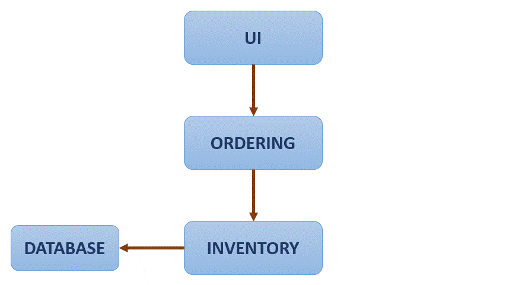

:date: 04-08-2021

=============================
IBM Containers and Kubernetes
=============================

Containers
----------

A container is an executable unit of software, in which the application code is
packaged along with its libraries and dependencies in common ways, so it can be
run anywhere (on-premises or in the cloud). Containers take the form of an OS
virtualisation which features of the OS are used to isolate process and control
the amount of CPU, memory and disk storage. In the case of Linux kernel
namespaces and c-groups allow this virtualisation. Containers are small and
portable. The software that boost up this technology was **Docker**. Nowadays,
a container is a standarization of how we package and share software, so its
main characteristic is portability. Container do not include a guest OS, spin
ip quickly and scale horizontally. They are also platform independent and allow
to scale each component of an application individually as for microservices.

Docker
------

It has become the standard on containerization, is a software platform for
building and running containers launched in 2013. It provides a straightforward
way to build and run containers. Docker is commonly used throw Docker CLI,
which provides commands as:

.. code-block:: bash

  build     ← Creates container images (requires Dockerfile)
  tag       ← Copy an image and give it a new name. Tags are pointers to images
  images    ← List all iomages, their repositories and tags, and their size
  run       ← Runs a container locally (usually for testing purposes)
  push/pull ← Stores images or retrieves them from remotes locations

Images (Dockerfile)
*******************

They outline all the steps necessary to build an image. A container is
different from its image. Images are immutable, if you change it, it is a new
image. On the other hand, a container is an instance of an image.

Images are organized in layers, one after another, containing instructions to
build the image. So each docker instruction constitutes a read-only layer, and
a writeable layer is added finally when an image is run as a container. Layers
can be shared between images, which shaves disk space and network bandwidth.

The main instructions are:

- ``FROM``: Define base image.
- ``RUN``: Execute arbitrary commands.
- ``ENV``: Set environment variables.
- ``ADD`` and ``COPY``: Copy files and directories. ``COPY`` is restricted just
  to local resources while ``ADD`` allow remote locations.
- ``CMD``: Define default command for container execution. Only one can be
  defined.

Example

.. code-block:: Dockerfile

   FROM ubuntu:18.04
   COPY . /app
   RUN make /app
   CMD python /app/app.py

Container images can be stored in your local machine, but there is a common
storage to distribute named container images, called container registry, which
could be public or private. Container registries could also be self-hosted or
just hosted which abbreviates hosted by provider.

Images are pushed to registries and pulled from them, depending on what are
you doing. Inside a registry there are repositories, which are collections of
similar images, which are tag differently, so when an image is pulled from a
repository, the usual path is: ``<hostname>/<repository>:<tag>`` e.g.
``docker.io/ubuntu:18.04``. We would pull it with: ``docker pull <image_path>``
in our machine.

Running Containers
******************

Let's suppose we have the following Dockerfile:

.. code-block:: Dockerfile

   FROM node:9.4.0-alpine
   COPY app.js .
   COPY package.json .
   RUN npm install &&\
       apk update &&\
       apk upgrade
   CMD node app.js

The command to create an image is: ``docker build -t my-app:v1 .``. The
``.`` at the end represents the build context, containing files used to
generate out image. Once the image has been built we can see out images with;
``docker images``. We can `retag` (or tag for the first time) the
images. To run an image the command ``docker run <image_tag>``. Finally, we can
push our image with: ``docker push <image_tag>``.

Container Orchestrations
------------------------

Over time, new applications are written and deploy, and applications take new
components that run independently, to avoid this becoming an overwhelming
containers swarm, container orchestrations are used.

Main tasks relying on containers orchestration tools are:

* Provisioning and deployment
* Availability
* Scaling
* Rolling updates
* Health checks

**Kubernetes** is a container orchestration tools that is self-defined as: `'A
portable, extensible, open-source platform for managing containerized worloads
and services that facilitates both declarative configuration and automation. It
has a large, rapidly growing ecosystem. Kubernetes services, support, and tools
are widely available'`. Kubernetes is not a traditional, all-inclusive
platform as a service (PaaS), does not limit the types of applications, does
deploy or build applications, it does not prescribe logging, monitoring or
alerting solutions and does not provide built-in middleware, databases or other
services.

Architecture
************

A deployment in Kubernetes is called a **cluster**. The control plane makes
decisions about the cluster and response to events. An example would be
scheduling workloads or creating new resources.

All communications in the cluster relies on **Kubernetes API server**. Also a
key component is the **etcd** which is a highly available key-value store
(similar to redis) that contains all cluster data, becoming the source of
truth for the state of the cluster. **Kubernetes scheduler** assigns new
created Pods to nodes and determines where workloads should run. **Kubernetes
controller manager** runs all the controller processes, monitors the cluster
state and ensures the actual and desired state matches. Finally, **Cloud
controller manager** runs controllers that interact with underlying cloud
providers, linking clusters into a cloud provider's API.

Nodes are worker machines in Kubernetes, managed by the control plane. Kubelet
communicates with the API server to ensure pods and associated containers are
running and reports health to the control plane. Container runtime downloads
images and runs containers being Docker and CRI-O well-known runtime. Lastly
Kubernetes proxy is a network proxy that maintains network rules that allow
communication to Pods (workloads of the cluster). A **control loop** is defined
as a non-terminating loop that regulates the state of the system.

Kubernetes objects are persistent entities in Kubernetes, that define the
desired state for your workload. The Kubernetes API is used to work with them,
mainly throw ``kubectl`` CLI. The status is the current state of the cluster
and the spect constitutes the desired state. Namespaces are used to segregate
components. Each cluster may have several of them. Namespaces provide logical
separation of a cluster when many teams are using it:

* Virtualization of a physical cluster
* Segregate cluster by team, project, etc.
* Necessary with larger numbers.
* Provides a scope for object names.

Names:

* Each object has a name.
* Names are unique for a resource type within a namespace (e.g. a pod and a
  deploy can have the same name within a namespace, a pod and another pod can
  have the same name if they belong to different namespaces).

Labels are key/value pairs attached to objects, intended for object
identification, but not unique, they organize and group objects. Selectors
identify and group a set of objects, used by Kubernetes controllers to monitor
resources.

Basic Objects
*************

Pod: Simplest unit. Represents processes runnings in a cluster. Encapsulates a
container or multiple. Replicating them serves to scale horizontally:

.. code-block:: docker

   apiVersion: v1
   kind: Pod
   metadata:
       name: nginx
   spec:
       containers:
       - name: nginx
         image: nginx:1.7.9
         ports:
         - containerPort: 80

ReplicaSet: Group of identical pods that are running. Definition now contains
the number of replicas and the template used to create each replica. **It is
not recommended to create ReplicaSets directly**.

.. code-block:: docker

   apiVersion: apps/v1
   kind: ReplicaSet
   metadata:
       name: nginx-replicaset
       labels:
           app: nginx
   spec:
       replicas: 3
       selector:
           matchLabels:
               app: nginx
       template:
           metadata:
               labels:
                   app: nginx
           spec:
               containers:
                   - name: nginx
                     image: nginx:1.7.9
                     ports:
                     - containerPort: 80

Deployment: Provides updates for Pods and ReplicaSets, allow to run multiple
replicas of your application and are suitable for stateless applications.
Deployments are more robust and provide additional objects than ReplicaSets,
even if simple specifications can look mostly the same. Deployments allow
rolling updates, so replicas are there to effectively response for counting
pods while deployments are responsible for orchestrating the roll out of
new versions.

.. code-block:: docker

   apiVersion: apps/v1
   kind: Deployment
   metadata:
       name: nginx-deployment
       labels:
           app: nginx
   spec:
       replicas: 3
       selector:
           matchLabels:
               app: nginx
       template:
           metadata:
               labels:
                   app: nginx
           spec:
               containers:
                   - name: nginx
                     image: nginx:1.7.9
                     ports:
                     - containerPort: 80

``kubectl`` CLI
***************

Key tool for working with Kubernetes, clusters and workloads running on
clusters. 2 families of commands:

**Imperative**: Quickly create, update and delete Kubernetes objects and easy
to learn. Do not provide audit trail and not really flexible.

.. code-block:: bash

   kubectl run nginx --image nginx

There are imperative commands that use a configuration template, which specify
and operation, so other members of the team can launch your containers
properly.

.. code-block:: bash

   kubectl create -f nginx.yaml

Any updates made after configuration file is created will not be automatically
recorded.

**Declarative**: Configuration files define one or more objects, no operation
is specified, needed operations are inferred by ``kubectl``, works better on
directories, configuration files define desired state and Kubernetes actualizes
that state.

.. code-block:: bash

   kubectl apply -f nginx/

All files in a directory will be applied, so this is the preferred method on
production systems.

Using Kubernetes
****************

The most relevant command is ``apply`` that, as explained above, works both
in files and directories. ``get`` and ``describe`` operate on namespaces former
listing resources (deployments) and second showing details:

.. code-block:: bash

   kubectl get deployment --namespace kube-system
   kubectl describe deployment kube-dns-amd64 --namespace kube-system

So to create a deployment:

.. code-block:: bash

   >>> kubectl apply -f nginx.yaml
   deployment.apps/nginx-deployment created
   >>> kubectl get deployment
   NAME             READY       UP-TO-DATE      AVAILABLE       AGE
   nginx-deployment 3/3         3               3               73s

Managing Applications
---------------------

Key concepts on manage Kubernetes applications are: ReplicaSets, auto-scaling,
rolling updates, ConfigMaps and Secrets and Service binding.

**ReplicaSets**: Are used to manage pods, ensuring the current number of pods
are always up and running. They can replicate, restart or spin up pods, adding
existing pods to the deployment or creating them. They ensure the maintain of
desired state and supersede replica controller. With every deployment a
ReplicaSet is created. One main idea of Kubernetes is independence between
objects (loosely coupled yet interconnected), that is why ReplicaSets manage
pods making use of labels.

After creating a deployment we can run:

.. code-block:: bash

   >>> kubectl get replicaset
   NAME                         DESIRED CURRENT READY   AGE
   hello-kubernetes-5655b5446f8 1       1       1       14m

It is highly recommended to create deployments instead of ReplicaSets:

.. code-block:: bash

   >>> kubectl create -f deployment.yaml
   deployment.apps/hello-kubernetes created
   >>> kubectl get pods
   NAME                                 READY   STATUS  RESTARTS    AGE
   hello-kubernetes-5655b5446f8-2nlqb   1/1     Running 0           6s
   >>> kubectl get deploy
   NAME             READY   UP-TO-DATE  AVAILABLE   AGE
   hello-kubernetes 1/1     1           1           12s
   >>> kubectl scale deploy hello-kubernetes --replicas=3
   NAME                                 READY   STATUS  RESTARTS    AGE
   hello-kubernetes-5655b5446f8-2nlqb   1/1     Running 0           33s
   hello-kubernetes-5655b5446f8-5mflw   1/1     Running 0           3s
   hello-kubernetes-5655b5446f8-htb7v   1/1     Running 0           3s

We can check that ReplicaSet is working deleting one of the pods and watching
how the ReplicaSet immediately recreates it.

**Autoscaling**: We have seen how to scale the applications using ReplicaSets,
but we can use the Horizontal Pod Autoscaler (HPA) to scale up and down as
needed, which can be configured based on desired CPU, memory, etc. Autoscale
is used like:

.. code-block:: bash

   >>> kubectl autoscale deploy hello-kubernetes\
   >>>                   --min=2 --max=5 --cpu-percent=10
   [16:10:46]
   horizontalpodautoscaler.autoscaling/hello-kubernetes autoscaled

The parameter ``cpu-percent`` triggers the scale. The number of replicas of the
ReplicaSet is then changed. An HPA can be created as a standalone, but the
``autoscale`` command is highly recommended.

**Rolling Updates**: Are a way to roll out app changes in an automated and
controlled fashion throughout pods. They work with pod templates such as
deployments. They allow for roll back. Steps:

1. Add liveness and readiness probes to your deployments. This ensures
   they are marked as ready appropriately.
2. Add a rolling update strategy to your YAML file.

   .. code-block:: yaml

      apiVersion: apps/v1
      kind: Deployment
      metadata:
        name: nginx-test
      spec:
        replicas: 10
        selector:
          matchLabels:
            service: http=server
        minReadySeconds: 5
        progressDeadlineSeconds: 600
        strategy:
          type: RollingUpdate
          rollingUpdate:
            maxUnavailable: 50%
            maxSurge: 2

   It ensures that at least 50% of the pods are always available. Once the image
   is updated in our docker-image repository, we should run:

   .. code-block:: bash

      >>> kubectl set image deployments/hello-kubernetes\
      >>>                   hello-kubernetes=upkar/hello-kubernetes:2.0
      deployment.extensions/hello-kubernetes image updated
      >>> kubectl rollout status deployment/hello-kubernetes
      deployment "hello-kubernetes" successfully rolled out

   This means that the deployment has been correctly updated. With the command
   ``rollout undo`` applied to the same deployment we would undo the update.

**ConfigMaps** and **Secrets**: Are the way to pass variables to our
applications. Environment variables should not be hardcoded. ConfigMaps and
Secrets just differentiate in former contains general (public) environment
variables while second contains sensitive variables (as API keys). They are
used to provide configuration for deployments, are reusable across them and
can be created:

1. Using string literals
2. Using and existing "key"="value" file
3. Providing a ConfigMap YAML descriptor file. First and second method could
   help to create this YAML.

They can be reference from a pod / deployment just as environment variables, or
mounting as a volume. The easiest way to pass a ConfigMap is just using the
``create configmap`` as follows:

.. code-block:: bash

   >>> kubectl create configmap my-config\
   >>>                --from-literal=MESSAGE="hello from first ConfigMap"
   configmap/my-config created

Then you add it to the ``env`` section of the YAML file of your image:

.. code-block:: yaml

   ...
   env:
       - name: MESSAGE
       valueFrom:
           configMapKeyRef:
               - name: my-config
               key: MESSAGE

There are 2 key commands to list and explore available ConfigMaps:

.. code-block:: bash

   >>> kubectl get configmaps
   NAME         DATA    AGE
   my-config    1       5m42s
   >>> kubectl describe connfigmap my-config
   Name:        my-config
   Namespace:   default
   Labels:      <none>
   Annotations: <none>

   Data
   ====
   MESSAGE:
   ----
   hello from first ConfigMap
   Events: <none>

A better way to create a ConfigMap is using a file, where variables are defined
as ``<key>=<value>`` pairs. Then you just pass the option
``--from-file=<your_file_name>`` to the ``kubectl create configmap`` command.

Secrets work mostly as ConfigMaps but the values of the stored keys are not
printed out by ``kubectl`` commands. So we can use the same methods described
above (options ``--from-literal`` and ``--from-file``) but just with
``kubectl create secret generic`` command. There is also the option to mount
secrets as a volume as follows:

.. code-block:: yaml

   spec:
       containers:
           - name: hello-kubernetes
             image: upkar/myapp:latest
             ports:
                 - containerPort: 8080
             volumeMounts:
                 - name: api-creds
                   mountPath: "/etc/api"
                   readOnly=true
             volumes:
                 - name: api-creds
                   secret:
                       secretName: api-creds

IBM provides a bunch of services (most related to NLP) that can be bind to our
application. When a service is bind to a cluster deployment the credentials are
available as a mounted Secret volume.

Kubernetes Ecosystem
--------------------

As stated on its own description Kubernetes is surrounded by a *large and
rapidly growing ecosystem*. Kubernetes is not an all-inclusive platform as a
service, providing a more flexible model rather than a more opinionated one.
The ecosystem provides many services that Kubernetes does not, we have already
seen many (firsts provided by Docker, the containerization tool):

* Building a container images
* Storing images in a container registry
* Logging and monitoring
* Continous Integration and Delivery (CI/CD)

The `Cloud Native Computing Foundation (CNCF) <https://github.com/cncf/trailmap>`_
hosts Kubernetes and provides resources to better understand the ecosystem.

**Red Hat OpenShift** is an hybrid cloud (can be run on premises or in public
or private clouds), enterprise Kubernetes (is the underlying technology)
application platform (provides additional tools for applications). It is built
on Kubernetes, provides several services using it (Automated Ops, Over-the-air
updates, Monitoring, Registry, Networking, Router, KubeVirt, OLM and HELM) and
offers Platform, Application and Developer services to client deployments. A
key concept is Origin Kubernetes Distribution (OKD) which is a *Kubernetes
distribution embedded in OpenShift (analogy: Kubernetes (Linux) kernel and OKD
(Arch) distribution*. It adds developer operations-centric tooling on top of
Kubernetes and its Open Source. Red Hat packages OKD with software, resources
and official support to create Red Hat OpenShift Container platform which is
the commercial product (OpenShift is the product and Kubernetes is an open
source project). OpenShift has its own CLI (``oc``) which add commands to
``kubectl``. Additionally it has a Web UI and incorporates the Deployment
Config objects based on old kubernetes object ReplicaSet Controller instead of
ReplicaSet, they include the capability to add triggers associated to certain
events. Open Shift is an opinionated platform, so it has prescribed ways of
deploy and manage your applications, reducing Kubernetes flexibility to gain
efficiency.

Cloud native development calls for automation and CI/CD is one example.
It automates build, test, merge, releasing to a repository and finally deploy.
For OpenShift a **Build** is the process of transforming inputs into a
resultant object (source code in a repo to a container image). A
**BuildConfig** is the blueprint of a Build, defining the process for a build
to follow. Some Builds are:

* Docker: Requires a repository with a Dockerfile and necessary artifacts,
  invokes the ``docker build``  command and pushes the image to the internal
  registry.
* Source-to-Image (S2I): Is a tool for building reproducible container images
  that injects application source into a container image to produce a
  ready-to-run image, eliminating the necessity to write a Dockerfile and
  including predefined builder images.
* Custom build: Is the more advanced strategy. It requires to define a builder
  image that is used for the build process, so Custom builder images are
  Docker images containing the logic needed to transform inputs into the
  expected outputs.

An example of BuildConfig would be:

.. code-block:: yaml

   kind: BuildConfig
   apiVersion: build.openshift.io/v1
   metadata:
       name: example
   spec:
       output:
           to:
               kind: imageStreamTag
               name: 'example:latest'
       strategy:
           type: Source
           sourceStrategy:
               from:
                   kind: imageStreamTag
                   name: 'nodejs:10-5CL'
       source:
           type: Git
           git:
               url: 'https://github.com/organization/repo'
           contextDir: /
       triggers:
           - type: Generic
           generic:
               secretReference:
                   name: example-generic-webhook-secret
           -type: GitHub
           github:
               secretReference:
                   name: example-github-webhook-secret
           -type: imageChange
           imageChange:
   runspolicy: Serial

In it, we must highlight:

* Output: Defines what build will produce
* Strategy: Defines the strategy that build will use
* Source: Defines the inputs that build needs.
* Triggers: Defines the events that can cause build to run.

Special attention is deserved by **Triggers**, that can be: webhooks (both a
request sent to an OpenShift Container Platform API endpoint or GitHub generic
webhooks), Image changes (new version available or similar) and Configuration
changes (when a new BuildConfig is created).

ImageStream is the way to represent images in OpenShift, which consist of an
abstraction for referencing images, do not contain image data just pointers to
images digests (ids) so deployments referencing certain ImageStream will not
update image even if it a new one is pushed with the same tag, it is necessary
make the ImageStream to point to the new image for deployments to update.
Finally, ImageStreams also allow to store source images in internal or external
registries or other ImageStreams.

**Operators** are used to automate tasks within a cluster. In addition to
Builds and Pods there are also Custom Resource Definitions (CRDs) which make
the Kubernetes API more modular and flexible. They can be installed in clusters
so they are cluster-specific and once one is installed its objects can be
accessed normally using ``kubectl``. CRDs are useful to store and retrieve
data on Kubernetes API, but **they do not change the actual state of the
cluster**, for this purpose Custom Controllers are needed. Controllers are
loops that monitor and reconcile the state of a cluster, so custom controllers
do the same for custom resources. Combination of custom resources and
controllers gives a true declarative API, and this combination is called **the
Operator Pattern**.

An Operator is then a way to package, deploy and manage a Kubernetes native
application. Human operators have deep knowledge of the system they oversee
knowing how to deploy services, how they services should behave and what to do
if something goes wrong. Software operators capture and automate this logic
in a way that can be deployed to a cluster.

In practice, when creating an application a CRD is created for the application,
having a controller for that CRD, operator logic determines how to reconcile
actual and desired states. So if one instance of the CRD is created, operator
know the additional resources and requirements that need to be created.

In OpenShift exists the OperatorHub where operators are offered and can be
installed with a simple click. Operators can be grouped in 3 families:
Red Hat (which are packaged by Red Hat), Certified (which are operators from
independent software vendors), Community (which are operators created by
the open-source community but not officially supported by Red Hat) and finally
Custom (which are defined by the user).

Microservices is a cornerstone of Cloud native applications, being an
architectural approach that requires each single application being composed of
many loosely coupled and independently deployable services that communicate
throw a well defined API. This architecture has many benefits, as updates and
developments are easier, but also bring up new challenges as traffic encryption
between services, canary deployments and A/B testing are required to expose
different version and see what users prefers, communication also allows
cascading failures if one of the services fall. **Service mesh** is a dedicated
layer for making service-to-service communication fast, secure and reliable.
Provides traffic management, security and observability, being the most
commonly used Istio.

**Istio** is platform independent but it is commonly used on Kubernetes
applications. It is composed by 4 modules:

1. Connect: Intelligently control flow of traffic and API calls between
   services, conduct a range of tests and upgrade gradually with red/black
   deployments. Enables canary deployments, A/B testing, etc.
2. Secure: Automatically secure your services through managed authentication,
   authorization and encryption of communication between services.
3. Control: Apply policies and ensure that they are enforced, and that
   resources are fairly distributed among containers.
4. Observe: See what is happening with rich automatic tracing, monitoring and
   logging of all your services.

One simple application of Istio can is the flow redirection:

As it is observed, the application flow if redirected gradually from one
service to another, avoiding a *hard change or reset*. With Istio traffic
between services can also be encrypted, and strict policies can be defined
setting what services can communicate with one another. Also you can see
metrics as number of requests between services and response times.
