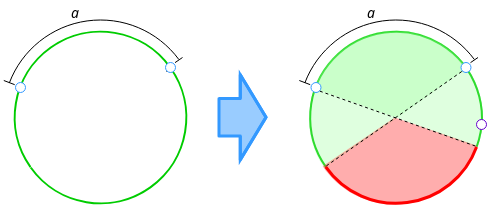
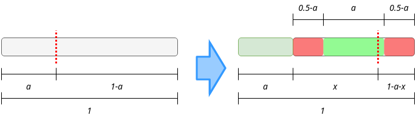

:draft: false
:date: 01-03-2020

================
Quants interview
================

At least once in your life you have to be interviewed by a team of quants. You
won't probably love that experience but is something that everyone should face,
to prove that you are now an adult.

I was interviewed by the XVA quants of Santander Bank, January of this year. I
know almost nothing about how to evaluate derivatives and even about what they
are so I had really low expectations, but people told me that they will make
math questions more than financial ones. Knowing that, I have prepared tons of
probability problems (as much as I can in 2 days), 2 of them I want to share
with you.

Math problems
-------------

These are problems that I found looking in the Internet and I think that they are beautiful.

Circle points
^^^^^^^^^^^^^

**If you take 3 random points into a circle, What is the probability of them
staying into the same semicircle?**

Let's take 2 random points into a circle, they will always be into the same
semicircle, so define the shortest distance between them as :math:`a`. The third
point now have both, the semicircle defined from the first point to the center
that contains the second point and the semicircle defined from the second point
to the center that contains the first point, allowed to be inside. We can
understand it better looking at the diagram:

If we take a circle of length 1, :math:`a` is going to be between 0 and 0.5 with
100% of probability and then we need our third point to stay outside of the
region of length :math:`a`. So the expected value is:

.. math::

    \langle f(x) \rangle = 1 - \frac{1}{\tfrac{1}{2}}\int_0^{\tfrac{1}{2}}xdx

So it is:

.. math::

    P(3\ points\ in\ the\ same\ semicircle) = \frac{3}{4}

You can check this out with this chunk of Python code (which is pretty slow,
but gives a fast approximation):

.. code-block:: python

    from random import random  # Bad module - function naming

    def simulate(N):
        hits = 0
        for i in range(N):
            a = 0.5 * random()
            x = random()
            if x > a:
                hits += 1
                score = hits / (i+1)
                print(f"{(i+1) / N:.2%} done. Current score is: {score}", end="\r")
        print(f"\nPredicted: {3/4:.2}")
        print(f"Difference: {abs((3/4) - score)}")

    if __name__ == "__main__"
        simulate(10**8)

Paper strip
^^^^^^^^^^^

**If you have a strip of paper, and you cut it twice, What is the probability
of the resulting 3 strips to form a triangle?**

.. admonition:: ERROR
   :class: danger

   Be careful, **the first solution is wrong**. I just leave it here because
   sometimes (weird times) mistakes are beautiful. Correct answer is :ref:`here
   <right-way>`.

This problem sounds pretty similar to the previous one but it is not exactly
the same. The condition here is that **any sum of a pair of sides must be lower
than the other side**, so let's suppose that we start with a strip of 1 unit
length. We cut it once, so we have 2 strips, one of length :math:`a` and the other
of length :math:`1-a`. The second cut will always be into the :math:`1-a` length strip,
as you can watch in this diagram:

It's easy to understand that just one half of the times our first random cut
will make :math:`a` lower than 0.5. Then, the second cut must be greater than
:math:`0.5-a` so it plus the previous are longer than 0.5 but must be lower than
0.5 itself. So we just have to calculate the **expected value** of this:

.. math::

    \langle f(x) \rangle = \frac{1}{\tfrac{1}{2}}\int_0^{\tfrac{1}{2}}\frac{x}{1-x}dx

Solve it:

.. math::

    \langle f(x) \rangle = 2 \cdot \int_0^{\tfrac{1}{2}}\left[\frac{1}{1-x} - 1 \right] dx

And get:

.. math::

    \langle f(x) \rangle = 2 \log(2) - 1

So this is the probability of the second cut to give a good piece, but to have the total probability of the problem we need to multiply by one half, which is the probability of the first cut to give a good piece. So **the final solution is**:

.. math::

    P(3\ pieces\ form\ a\ triangle) = \log(2) - \frac{1}{2}

And as before, you can check it out with this code:

.. code-block:: python

    from random import random  # Bad module - function naming
    from math import log

    def simulate(N):
        hits = 0
        for i in range(N):
            a = random()
            if a < 0.5:
                x = (1 - a)* random():
                if x > (0.5 - a) and x < 0.5:
                    hits += 1
            score = hits / (i+1)
            print(f"{(i+1) / N:.2%} done. Current score is: {score}", end="\r")
        print(f"\nPredicted: {log(2) - 0.5}")
        print(f"Difference: {abs(log(2) - 0.5 - score)}")

    if __name__ == "__main__"
        simulate(10**8)

.. _right-way:

Right way
^^^^^^^^^

I have made an unnecessary assumption, and that makes me reach a wrong
solution. To make this well we have to think about 2 **independent** cuts
(let's call them :math:`x` and :math:`y`), and the solution will seem pretty obvious.
The conditions are:

* One of the cuts must be lower than 0.5 and the other must be higher, which happens half of the times (lower - higher and higher - lower).
* The absolute difference between them must be lower than 0.5.

First condition is too straightforward so let's talk about second one. We can
solve it just ignoring the :math:`x`-dependence of the probability density function
used in the expected value evaluated above, but to show a different way, we can
define :math:`a` for the highest of :math:`\{x,\ y\}` and :math:`b` for the lowest. Using
them we can define dependent integration limits:

.. math::

    P(|x-y| < 0.5) = P(a-b > 0.5) = \frac{1}{\tfrac{1}{2}\cdot\tfrac{1}{2}}\int_0^{\tfrac{1}{2}}db\int_{\tfrac{1}{2}}^{b + \tfrac{1}{2}}da = \frac{1}{2}

So this multiplied by one half, (the other condition probability) give us:

.. math::

    P(3\ pieces\ form\ a\ triangle) = \frac{1}{4}

Which is the **correct answer**. As before, here is the code to check it:

.. code-block:: python

    from random import random  # Bad module - function naming
    from math import log

    def simulate(N):
        hits = 0
        for i in range(N):
            x, y = random(), random()
            if ((x < 0.5 and y > 0.5) or (y < 0.5 and x > 0.5)) and abs(x-y) <= 0.5:
                hits += 1
            score = hits / (i+1)
            print(f"{(i+1) / N:.2%} done. Current score is: {score}", end="\r")
        print(f"\nPredicted: {0.25}")
        print(f"Difference: {abs(0.25 - score)}")

    if __name__ == "__main__"
        simulate(10**8)

If quants ask you something like this, they will be expecting you to answer correctly in around 3-5 minutes. This problems are just for training, but let you demonstrate that you have pretty basic notions about statistics.

Financial problems
------------------

These are the problems that make them earn money, so you can't avoid this. Of
course there's a lot to learn about this matter but if you understand the
basics, you could have a ridiculously small hope.

Black-Scholes equation
^^^^^^^^^^^^^^^^^^^^^^

This is the most famous equation in derivatives evaluation, and everyone must know it if he wants to be part of the business. As I said I know almost nothing about derivatives so honestly, I can't say (barely understand) why it is that important, but I can explain how to obtain it.

Let's suppose that you are one of the cool guys and you want to evaluate an
option. If you don't know what an option is you don't need to, for me is just
something which's price relies on time and another thing with a random
behaviour (usually a stock, I prefer to call it the underlying, feels more like
a variable). So the option value can be defined like: :math:`V(t, S)`. Where the
:math:`S` stands for the underlying (the random *thing*). From now on you can feel
that everything that we are doing is just moving the randomness deeper into
equations, and that's somehow true. But they are rich and we are not so this
must be somehow true too, *theoretically* true.

* Let's suppose that the underlying price can be predicted using the equation
  of the `geometric Brownian
  motion <https://en.wikipedia.org/wiki/Geometric_Brownian_motion>`_

.. math::

    \begin{eqnarray}
    dS(t, W) &=& S(\mu dt + \sigma dW) \\
    where:\ W\ &is& stochastic\ (dW\ \propto \sqrt{dt}).\\
    \mu\ &is& the\ drift\ (percentage).\\
    \sigma\ &is& the\ standard\ deviation\ (percentage).
    \end{eqnarray}

* Now we want to know how :math:`V(t, S)` change, so we need:

.. math::

    \begin{eqnarray}
    dV(t, S) = \frac{\partial V}{\partial S} dS + \frac{\partial V}{\partial t} dt + \frac{1}{2} \left[ \frac{\partial^2 V}{\partial S^2} dS^2 + \frac{\partial^2 V}{\partial t^2} dt^2 + 2\frac{\partial^2 V}{\partial S \partial t} dtdS \right]
    \end{eqnarray}

* Here we can say that terms on :math:`dt` which's order is higher than 1 won't
  be considered. Furthermore we can replace :math:`dW^2` with :math:`dt` (this is also
  called [the Itô's lemma](https://en.wikipedia.org/wiki/It%C3%B4%27s_lemma)):

.. math::

    \begin{eqnarray}
    dV(t, S) = \frac{\partial V}{\partial S} dS + \frac{\partial V}{\partial t} dt + \frac{1}{2} \frac{\partial^2 V}{\partial S^2} S^2 \sigma^2 dt
    \end{eqnarray}

.. math::

* Replace :math:`dS` and get **the differential equation for the option value**:

.. math::

    \begin{eqnarray}
    dV(t, S) = \left(\mu S \frac{\partial V}{\partial S} + \frac{\partial V}{\partial t} + \frac{S^2 \sigma^2}{2} \frac{\partial^2 V}{\partial S^2} \right) dt + \sigma S \frac{\partial V}{\partial S} dW
    \end{eqnarray}

Now comes the financial part. We are going to build what's called a delta-hedge portfolio. That's what you build when you have options and you want to protect yourself from changes in their underlying price. The change in this portfolio's value is measured like:

.. math::

    \begin{eqnarray}
    \Pi &=& -V + \frac{\partial V}{\partial S}S\\
    d\Pi &=& -dV + \frac{\partial V}{\partial S}dS\\
    d\Pi &=& -\left(\frac{\partial V}{\partial t} + \frac{S^2 \sigma^2}{2} \frac{\partial^2 V}{\partial S^2} \right) dt\\
    \end{eqnarray}

It's uncertainty term (:math:`dW`) has vanished, so it is a riskless portfolio.
The rate of return of every riskless portfolio must be equal to the return of a
`zero coupon bond <https://en.wikipedia.org/wiki/Zero-coupon_bond>`_ which is the
riskless product par excellence.

.. math::

    \begin{eqnarray}
    dB = B \cdot r dt \rightarrow d\Pi = \Pi \cdot r dt\\
    \end{eqnarray}

And all we have to do know is equate our 2 formulas and simplify, to finally get **the Black-Scholes partial differential equation**:

.. math::

    \begin{eqnarray}
    r\left(-V + S\frac{\partial V}{\partial S} \right) dt = -\left(\frac{\partial V}{\partial t} + \frac{S^2 \sigma^2}{2} \frac{\partial^2 V}{\partial S^2} \right) dt\\
    \frac{\partial V}{\partial t} + \frac{S^2 \sigma^2}{2} \frac{\partial^2 V}{\partial S^2} + rS\frac{\partial V}{\partial S} - rV = 0
    \end{eqnarray}

There are many numerical methods to solve the equation and it has analytical solutions for some boundary conditions. But I won't go further on this.

The interview
^^^^^^^^^^^^^

So you have prepared this kind of problems and you feel comfortable with any medium-level math situation. You are willing to get so focused on the problems you forget you are in an interview. And you reach the quant's space. Everyone has his lunch over the table and it seems like they spend a lot of time with their computers. No blackboards, no super-cool coffee machine, no knick-knacks to avoid your brain getting out of sugar. Not what I was expecting but let's give it a try.

2 guys sat around me in a table into a meeting room, and asked me about my background, if I know what a CAP is (I barely knew it), and they told me that we were in a Liborg transition (we are getting into an unknown place for me) so... **If Liborg's value follows a standard normal probability distribution, how would you evaluate a CAP?**.

OK. I wasn't expecting that. I was wearing a wool sweater and I started sweating and felt my heart racing. All I had were just doubts. But what should I do.

A CAP is a product that pays the maximum of Liborg's price minus a constant value, and zero, so:

.. math::

    \begin{eqnarray}
    V(L) &=& \max(L-K, 0)\\
    where\ K\ &is& a\ constant.\\
    L\ &is& the\ Liborg's\ price.
    \end{eqnarray}

But they had told me that the Liborg's price follows a standard normal
distribution (:math:`\mathcal{N}(\mu, \sigma)`) so I just need to get the expected
value:

.. math::

    \begin{eqnarray}
    \langle V(L) \rangle &=& \frac{1}{\sqrt{2\pi\sigma}}\int_{-\infty}^{\infty}\max(L-K, 0) \exp\left(\frac{-(L-\mu)^2}{\sigma^2}\right)dL\\
    \langle V(L) \rangle &=& \frac{1}{\sqrt{2\pi\sigma}}\int_{K}^{\infty}(L-K) \exp\left(\frac{-(L-\mu)^2}{\sigma^2}\right)dL
    \end{eqnarray}

Of course we need to keep going, even if this is currently an analytical solution. Let's make the easiest part (this is as far as I got in the interview):

.. math::

    \begin{eqnarray}
    \frac{-K}{\sqrt{2\pi\sigma}}\int_{K}^{\infty}\ \exp\left(\frac{-(L-\mu)^2}{\sigma^2}\right)dL = \frac{-K}{\sqrt{2\pi\sigma}} \Phi(-K)
    \end{eqnarray}

And now the hardest one:

.. math::

    \begin{eqnarray}
    \frac{1}{\sqrt{2\pi\sigma}}\left[\int_{K}^{\infty} (L-\mu)\exp\left(\frac{-(L-\mu)^2}{\sigma^2}\right)dL + \mu\int_{K}^{\infty} \exp\left(\frac{-(L-\mu)^2}{\sigma^2}\right)dL \right]
    \end{eqnarray}

Of course this is the same that we had before for :math:`K` but for :math:`\mu`:

.. math::

    \begin{eqnarray}
    \frac{\mu}{\sqrt{2\pi\sigma}}\int_{K}^{\infty}\ \exp\left(\frac{-(L-\mu)^2}{\sigma^2}\right)dL = \frac{\mu}{\sqrt{2\pi\sigma}} \Phi(-K)
    \end{eqnarray}

Using a new variable:

.. math::

    \begin{eqnarray}
    u = \frac{-(L-\mu)^2}{\sigma^2} &\rightarrow& (L-\mu)dL = \frac{-\sigma^2}{2}du\\
    -\frac{\sigma^2}{2\sqrt{2\pi\sigma}}\int_{-\tfrac{(K-\mu)^2}{\sigma^2}}^{-\infty}\ e^u du &=& \frac{\sigma^2}{2\sqrt{2\pi\sigma}} \exp{\left(-\frac{(K-\mu)^2}{\sigma^2}\right)}
    \end{eqnarray}

And finally putting all together:

.. math::

    \begin{eqnarray}
    \langle V(L) \rangle = \frac{1}{\sqrt{2\pi\sigma}} \left[ \frac{\sigma^2}{2} \exp{\left(-\frac{(K-\mu)^2}{\sigma^2}\right)} + (\mu - K)\Phi(-K) \right]
    \end{eqnarray}

And that's it. I got out of the interview thinking that it was a too hard question for just a Junior interview (without any experience in derivatives evaluation) but once I got home, I thought about it more closely and didn't find it so difficult.

*I didn't pass the interview* (sad life).

