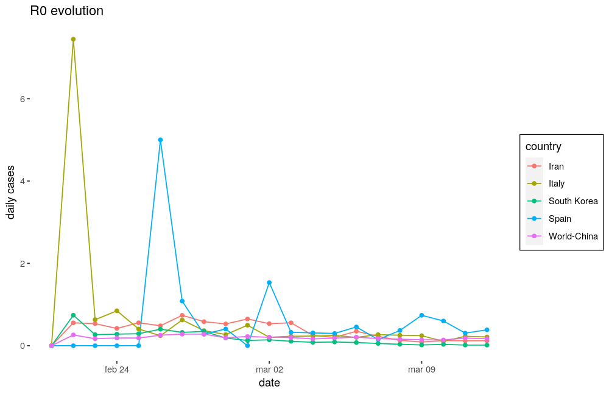

:draft: false
:date: 14-03-2020

========================
COVID-19, first thoughts
========================

A lot of material has being created since this disease spreads throw more than 120 countries becoming a global problem. Maybe you, like I am, are supposed to stay at home, trying to interact with as few people as possible.

So because I am at home, and I have a lot of time, I have decided to make a brief post, analysing the situation from a mathematical point of view, to understand what we are responsible of, and how this is supposed to evolve.

How diseases spread
-------------------

The mathematical model to understand how any disease will spread throw population is pretty simple, let's say that today there are :math:`N_d` persons infected and tomorrow we will have :math:`N_{d+1}`, so:

.. math::

    \begin{aligned}
    N_{d+1} &= N_d \cdot (1 + R0)\\
    where\ R0\ &stands\ for\ secondary\ cases
    \end{aligned}

What :math:`R0` means is how a primary case spreads, or how many people are infected from a single original case (we will get deeper later). The thing that we should found dangerous here is that the number of cases one day depends on the number of cases the previous one, doing some math:

.. math::

    \begin{aligned}
    N_{d+1} - N_d &= R0 \cdot N_d \\
    \frac{d N}{d t} &= R0 \cdot N \\
    \frac{d N}{N} &= R0 dt \\
    N(t) &= N_0 \cdot e^{R0 \cdot t} \\
    where\ N_0\ are\ the\ cases\ at\ t &= 0
    \end{aligned}

And there we have it, the **exponential growth**, and these are not good news.

Is exponential growth a fact?
-----------------------------

Of course it is, at least in the early stages. I have taken some data (corresponding to the publication day) and see how our model adjusts the Covid-19's spread, but first let's take a look at the top 5 countries (China, Italy, Iran, South Korea, and Spain) that have most people infected nowadays, and the worldwide records:

.. image:: ../../_static/img/posts/Covid_19/complete.png
   :width: 100%
   :alt: Data complete
   :class: pic-invert

First we must say that clearly it was the 21 :math:`^{st}` of February when the problem stopped being just a Chinese problem and became global. Of course that 20K jump on February 17 :math:`^{th}` doesn't sound legit, so I am going to remove China from the global data, and from the list, and compare the remaining countries from February 21 :math:`^{st}`.

This looks more adjustable, so what I am going to do are 2 really simple things:

1. Just take logarithms in both sides (this will bias the result to lower values, but that could be considered positive) of our equation and try to make a linear regression:

   .. math::

       \begin{aligned}
        N(t) &= N_0 \cdot e^{R0 \cdot t} \\
        \log(N(t)) &= \log(N_0) + R0 \cdot t \\
        x_{T0} &= \log(N_0)
       \end{aligned}

2. Because the daily cases are nothing more than :math:`\tfrac{\Delta N(t)}{\Delta t} \rightarrow \tfrac{dN(t)}{dt}` I am going to differentiate and see how true it is:

   .. math::

       \begin{aligned}
        \frac{dN(t)}{dt} &= N_0 \cdot R0 \cdot e^{R0 \cdot t} \\
        \log\left(\frac{dN(t)}{dt}\right) &= \log(N_0 \cdot R0) + R0 \cdot t \\
        x_{D0} &= \log(N_0 \cdot R0) \\
        e^{x_{D0} - x_{T0}} &= R0
       \end{aligned}

With 2 linear regressions we have 3 ways to approximate :math:`R0`'s value. Let's go.

Adjusting number of cases
^^^^^^^^^^^^^^^^^^^^^^^^^

As I said I have made this 2 linear regressions getting these results:

.. image:: ../../_static/img/posts/Covid_19/linearregs.png
   :width: 100%
   :alt: Linear Models
   :class: pic-invert

The plots are already telling us that these regressions are really good, and fit the data almost perfectly (total numbers of cases fitted a bit better), but we can check some statistics to measure how good they are:

.. raw:: html

    

    <table>
      <caption>Models main statistics</caption>
      <thead>
        <tr>
          <th>Plot</th>
          <th>Intercept</th>
          <th>Slope</th>
          <th>R2</th>
          <th>p-statistic</th>
        </tr>
      </thead>
      <tbody>
        <tr>
          <td>Total cases</td>
          <td>1.49 &#177; 0.13</td>
          <td>0.1826 &#177; 0.003</td>
          <td>0.995</td>
          <td>2.2e-16</td>
        </tr>
        <tr>
          <td>Daily cases</td>
          <td>0.20 &#177; 0.30</td>
          <td>0.1698 &#177; 0.0072</td>
          <td>0.967</td>
          <td>1.648e-15</td>
        </tr>
      </tbody>
    </table>
    

.. admonition:: Note
   :class: note

   I work making models and I have never seen such a :math:`R^2`.

.. raw:: html

    

.. admonition:: Warning
   :class: warning

   It must be notice that the **Intercept** corresponds to January 20 :math:`^{th}`, when only China has cases.

As you are probably thinking both slopes must be the same (:math:`R0`) and I have gotten 2 different values, but their difference is low (< 10%) so no reason to worry. More difficult will be trust the value coming from the intercepts difference, because one of them has a high uncertainty (same order of magnitude as the value obtained) and the evaluation mechanism will not mitigate it:

.. math::

    \begin{aligned}
    R0 &= e^{x_{D0} - x_{T0}} \\
    R0 &= e^{0.20 - 1.49} = 0.2753 \\
    \Delta R0 &= \frac{\partial R0}{\partial x_{D0}} \cdot \Delta x_{D0} + \frac{\partial R0}{\partial x_{T0}} \cdot \Delta x_{T0} = R0 \cdot (\Delta x_{D0} + \Delta x_{T0})\\
    \Delta R0 &= R0 \cdot (0.13 + 0.3) = 0.1184
    \end{aligned}

As we can see it has a 43% of uncertainty which is pretty high to use it, even more if we consider the values coming from the slopes, that have uncertainties around 10 times lower. Once that is said we have obtained:

+--------------------------------+
| :math:`R0 = 0.1762 \pm 0.0051` |
+--------------------------------+

This number is too big, if it keeps at that value until the end of the month, in the best case scenario (using the lowest :math:`R0` value within its uncertainty) we will be facing more than 800K cases (excluding China). To have an idea about what **exponential growth** means, it's useful to notice that in the worst case scenario we will be facing more than the double of cases. A 5.6% reduction on :math:`R0` value means a half reduction in total cases after 20 days.

R0 interpretation
-----------------

As I have said :math:`R0` is the number of secondary cases infected by a primary case. Going back to our first equation (:math:`N_{d+1} = N_d \cdot (1 + R0)`) we can now watch how :math:`R0` has evolved:

Here we can see that it has high peeks, usually corresponding to the first cases and then it tends to establish around a value lower than one everywhere but South Korea, which should has made and excellent work, and has reduced this value to almost zero.

Being responsible
^^^^^^^^^^^^^^^^^

That is its definition but we can redefine it using 2 new variables:

* :math:`E` stands for the number of persons that have physical contact with the infected person.
* :math:`p` stands for the probability of the disease to be transmitted during a physical contact.

So, according to the model, the number of infected persons that we are going to have tomorrow is:

.. table::
   :align: center

   +--------------------------------------------------------+
   | :math:`N_{tomorrow} = N_{today} \cdot (1 + E \cdot p)` |
   +--------------------------------------------------------+

So our intention must be clear (being South Korea), **reduce the parenthesis to zero**. The first one is not exactly a one, there is people recovering from being infected, so our immune system and our health system (we love our medical staff) are cooperating to make it go down.

But the number of persons that we physically interact with, and the probability of that interaction to result into an infection, each one of us is responsible to make them get lower (to wash your hands and don't touch your face reduce probability of infection; **to stay at home** reduce the number of persons you physically interact with to almost zero). This is not about isolating yourself, you can see your friends and family throw any device. This is about staying away from people (for a few days).

Model limitations
-----------------

Of course there is a saturation point waiting ahead of any disease spread, as more people get infected lower is the number of people that can get infected. Probably our exponential is just the beginning of a sigmoid. And there should be a correction factor associated with the idea of people used to interact always with the same people, that we can call local factor. Both of these are good news. But it is early to study the infection growth and, as we have seen the exponential growth explains it pretty well (I have used just the last 20 days).

References
----------

* This post is inspired in `this video <https://www.youtube.com/watch?v=Kas0tIxDvrg>`_.
* All the data used to make this post comes `from here <https://ourworldindata.org/coronavirus#deaths-from-covid-19>`_.
* Another cool places to stay updated of Covid-19 situation:

  - `ArcGis experience <https://experience.arcgis.com/experience/685d0ace521648f8a5beeeee1b9125cd>`_
  - `Information is beautiful <https://informationisbeautiful.net/visualizations/covid-19-coronavirus-infographic-datapack/>`_
