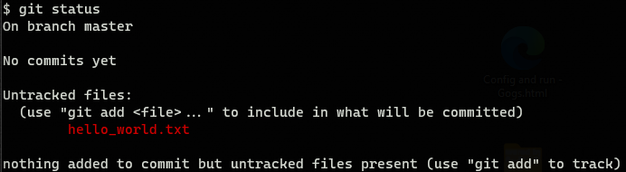
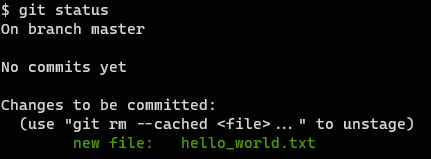
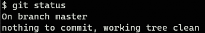
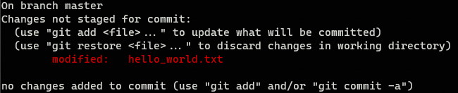
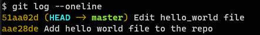
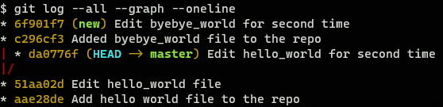
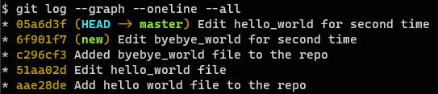

##########
Git Primer
##########

`Git`_ is a **version control system**, which means it is intended to be used to manage different file versions. You can think about `Git`_ as a supervisor that is reading the changes that you are doing in files inside a `Git`_ repository.

There are tons of "in-depth" `Git`_ tutorials on the Internet, so here I have just collected the most basic commands and concepts that you need to know to use `Git`_.

.. note::
   For more technical explanations of the concepts presented here the :ref:`posts/programming/2021-10-22-Git_primer:references` should be of great help

Finally, **all the commands represented in this document are examples**, they are not supposed to be executed anywhere, but they should work as far as you are using `Git Bash from Git for Windows <https://gitforwindows.org/>`_ if you are using Windows, and `Git`_ installed if you are using Linux or MacOS.

.. ---------------------------------------------------------------------------

********
Gitpedia
********

There are many concepts that are broadly used when you are working with `Git`_ but also might be new if you have never worked with it before:

Repo(sitory)
  This is the key concept and sadly it is also ambiguous. A repository is a directory (a folder for Windows users), in which changes are being tracked using `Git`_. This is also called **the root directory**. This directory must have a ``.git`` directory inside, and there is where `Git`_ is tracking all the changes. Strictly talking **the** ``.git`` **directory is the repository**, and the rest of the contents of the root directory are the **worktree**, but everyone uses "repo" to refer to the root directory.

Worktree
  It is a specific version of the **root directory**. When `Git`_  tracks the **root directory**, a specific status of the directory can be saved. Each of these saved status has specific worktree.

Commit
  It refers both to the action of save a specific worktree and to the worktree itself. So, once you have *committed* your changes you can check the worktree associated to that specific *commit*. Normally, after doing some modifications in the **root directory** you want to save the current status so you commit a set of changes, `Git`_ then stores them.

Branch
  A `Git`_ repository is a tree structure. You start having just one branch (the trunk) but then you can create multiple deviations from it. So when you decide to, from a specific commit, start evolving the repository in a different way, you are creating a ramification of the ``main`` development path, that is a branch.

Remote
  `Git`_ repositories can be replicated. You can tell `Git`_ that this repository in your machine should be aware of changes in that replica of the repository in that other machine (or also in your machine). Each of those connected repositories is called **remote**. Only changes that have been *commited* can be shared across replicas.

Push
  Refers to the action of storing changes of your repository in a replica(ted) repository.

Pull
  Refers to the action of storing changes of a replica(ted) repository in your repository.

Clone
  Refers to the action of creating a repository in your machine that replicates a remote repository and normally check a specific worktree.

.. ---------------------------------------------------------------------------

***************
Git by yourself
***************

`Git`_ is a great tool for developers to collaborate, but it is not just mean for that. You can use `Git`_ to have a much clearer understanding on how your projects evolve.

Lets assume you (as "Developer A") start working on a project called "my_project" so you create a directory called ``my_project`` in your computer, located at ``~/repos/my_project`` (``%USERPROFILE%\repos\my_project`` in Windows). If you want to initialize a `Git`_ repository here you just have to:

.. code:: bash

   cd ~/repos/my_project
   git init

Then you must see how `Git`_ has created the repository folder ``.git`` inside ``~/repos/my_project``.

Adding changes
==============

Now you create a file called ``~/repos/my_project/hello_world.txt`` and write something on it. You can check how `Git`_ see those changes by calling:

.. code:: bash

   git status

The output would be similar to this one:

`Git`_ knows that you have added a new file, but it is saying that it is not tracking it. To tell `Git`_ to track the file you have to execute:

.. code:: bash

   git add ./hello_world.txt
   git status

The output would be similar to this one:

`Git`_ is telling you that ``./hello_world.txt`` file **has changed** but the changes are **not registered**, so if you add additional changes to this file, you want be able to recover this specific status using `Git`_. To register the changes execute:

.. code:: bash

   git commit -m "Add hello world file to the repo" ./hello_world.txt
   git status

When you commit your changes it is good practice to add an expressive message, explaining **why** are you registering these changes. Writing good messages is an indicator of your quality as a developer, a lot of teams impose `specific format for commit messages <https://www.conventionalcommits.org/en/v1.0.0/>`_.

The output would be similar to this one:

`Git`_ is telling you that all the changes of the repo are registered, so everything is fine.

Now lets assume that you keep modifying the ``hello_world.txt``, then ``git status`` will show something like this:

Telling you that there are new changes in ``hello_world.txt`` and offering you to:

- ``git add``: Add these changes to the stage, so they will be part of the next commit.
- ``git restore``: Discard these changes and put the file back to the previous (committed) status.

Lets assume you think changes are fine and commit them, now you have 2 commits. You can see them by executing

.. code:: bash

   git log --oneline

The output would be similar to this one:

Here you have a lot of information (and `much more information <https://git-scm.com/docs/git-log>`_ can be displayed). First thing on each line is the **commit-hash**, it is how `Git`_ makes reference to each particular status of the repository. For `Git`_ your repository is just a tree of commits, and you can navigate them smoothly using these hashes. The information between parenthesis is telling you that the current ``HEAD`` (it is the worktree you are watching) is pointing to branch ``master``.

Branching
=========

Now imagine this is a working version and you want to evolve it but do not want to mess with it. Then you have to create a branch and work on it. Execute:

.. code:: bash

   git branch new
   git checkout new

You are now in a new branch (you can have the same result by executing ``git checkout -b new``). For now both branches ``master`` and ``new`` are identical, lets add a new file called ``byebye_world.rst`` to this branch and commit the changes.

And to make life more interesting we are going to modify one more time ``byebye_world.txt`` in ``new`` branch and ``hello_world.txt`` in branch ``master``, so our branches have evolved differently. After doing so we can execute:

.. code:: bash

   git log --all --graph --oneline

The output would be similar to this one:

The situation now is quite complicated, there are 2 branches, bifurcation has happened at commit ``51aa02d``, but each one has evolved differently. If ``new`` branch is useless we can delete it (``git branch -d new``) and keep going with our life, but if not...

Reconciling
===========

This is the most annoying part of using `Git`_, but if you become good at this, you are going to have much more love in your life.

When there are separate worktrees, in our case ``master`` and ``new``, that we want to reconcile (assume we want to put changes of ``new`` into ``master``) we can follow 2 approaches:

Merging
-------

The history of ``new`` worktree is *squashed* and a new commit in the other ``master`` worktree is created incorporating all the changes from ``new``. Lets do it. Just be sure that you have ``master`` checked out, and execute:

.. code:: bash

   git merge new
   git log --graph --oneline

The output would be similar to this one:

.. image:: ../../_static/img/posts/Git_primer/git_7.png
   :alt: Git log merged branches
   :align: center

Now we also have file ``byebye_world.txt`` in ``master`` branch with all the changes.

.. warning::

   Merge commits are something developers tend to dislike because they are not really expressive. If you use this reconciling strategy you might want to change the message.

Rebasing
--------

The history of ``new`` worktree is moved into ``master`` worktree. This is the preferred way because, the source worktree is integrated into target worktree history, so results are clearer. Just execute:

.. code:: bash

   git rebase new
   git log --graph --oneline --all

The output would be similar to this one:

The result is the same much the log result is much obvious now.

.. note::
   Rebasing is the usual procedure to alter branch history. You can use it for other purposes than reconciling branches, but with great power... Be careful.

To configure ``rebase`` as reconcile default reconcile strategy you need to run:

.. code:: bash

   git config --global pull.rebase true

Conflicts
---------

Normally, when you reconcile 2 worktrees there is going to be conflicts (files that are changed in both worktrees and `Git`_ do not know how to combine those changes). When that happens you have to **manually** edit the file to define a working version that takes the best from both worktrees. Sometimes this can be tedious and error prone and it is the main reason why developers are afraid of reconciling. There are a lot of literature about how to avoid conflicts (most popular is `atomic commits <https://www.aleksandrhovhannisyan.com/blog/atomic-git-commits/>`_) but the best is that you are prepared for them because they are going to happen. Just take advantage of your editor capabilities and make some tea. It is not going to be as traumatic as you are guessing.

.. ---------------------------------------------------------------------------

***************
Git with others
***************

Now that "Developer A" knows how to maintain and work with git repositories it is time to learn how to share your work and collaborate with others.

Pushing
=======

Lets assume that you (Developer A) want to publish your repository ``~/repos/my_project`` to ``https://gitserver.com/repos/my_project`` . Just be sure that you have ``master`` checked out, and execute:

.. code:: bash

   git remote add origin https://gitserver.com/repos/my_project
   git push --set-upstream origin master

Here you are doing 2 things:

1. Defining a ``remote``, named ``origin``, that corresponds to the URL ``https://gitserver.com/repos/my_project``
2. *Pushing* (or publishing) your changes to ``origin`` remote.

Be aware that your repositories can have more than one remote, the one named ``origin`` is the one used when you used no arguments (depends on `Git`_ configuration).

Now you can connect to the server and see how there is an exact replica of the repository in your local machine.

Cloning
=======

Lets assume that you (Developer B) want to make some changes in ``https://sharepoint/repos/my_project``. Lets assume that ``~/repos`` also exists in your machine. Then you have to execute:

.. code:: bash

   git clone https://sharepoint/repos/my_project ~/repos/my_project
   cd ~/repos/my_project

This way you have a directory ``~/repos/my_project`` that is a replica of the last version published by Developer A in ``https://sharepoint/repos/my_project``. You can now start working as defined in section :ref:`posts/programming/2021-10-22-Git_primer:git by yourself`.

Once your changes are ready to be shared with Developer A, you just have to commit them and ``push`` (as Developer A did in :ref:`posts/programming/2021-10-22-Git_primer:pushing`).

Pulling
=======

If the worktree published in ``https://sharepoint/repos/my_project`` changed before you push, you would have to reconcile remote version with your local one before pushing. To do that, you just execute:

.. code:: bash

   git pull origin

When you pull from a remote, `Git`_ will try to reconcile remote and local worktrees using the strategy defined in your config, so it is highly recommended to set up ``rebase`` (as explained in :ref:`posts/programming/2021-10-22-Git_primer:Rebasing`).

.. ---------------------------------------------------------------------------

**********
References
**********

- `Git`_: Homepage.
- `Learn Bitbucket with Git <https://support.atlassian.com/bitbucket-cloud/docs/tutorial-learn-bitbucket-with-git/>`_: Company oriented but has great cover of the basics.
- `What is version control <https://www.atlassian.com/git/tutorials/what-is-version-control>`_: For beginners, you can just start here and advance through the whole tutorial.
