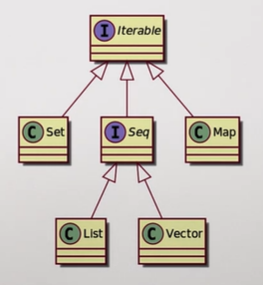

:draft: false
:date: 03-05-2022

##############################
Effective Programming in Scala
##############################

******
Basics
******

For symbolic operations **infix syntax** is preferred over **dot-notation**, so, for example:

.. code-block:: scala

   true && true   // prefered
   true.&&(true)  // equivalent
   1 + 2 * 3      // prefered
   1.+(2.*(3))    // equivalent

Types
=====

* Boolean: ``true`` and ``false``.
* Int: 32-bit signed integer, i.e.: :math:`x \in [-2^{31}, 2^{31} - 1]`.
* Double: 64-bit floating point number.
* String: Text.

The result of arithmetic operations has the type of the widest operand, if an operation expects a ``Double`` and ``Int`` is passed, it is automatically expanded. However if an ``Int`` is expected and a ``Double`` is passed, a type error is raised.

As types define how expressions can be combined by applying operations to them, operations are also called members of types. If you try to apply an operation on an expression whose type does not provide such an operation an error is raised.

Scala compiler check that programs are well typed before they are evaluated, so type errors can't happen at run-time.

.. note::
  In worksheets there is no distinction between compilation and evaluation.

Types can be explicitly indicated like so: ``val number: Int =  5 * 3``, however, in general the compiler is able to infer such types.

Methods
=======

.. code-block:: scala

   val door = 2 * 1.5
   def house(facade: Double, window: Double): Double =
     facade - door - window * 2
   end house

In the example ``facade`` and ``window`` are parameters of the method ``house``. The body of method (method definition) can expand several lines, all the lines with the same level of indentation make a block, which ends up with the **resulting expression**, and optionally you can add an ``end`` statement, like in the example.

.. warning::
  In Scala 2 blocks were delimited by braces ('{…}')

Explicit result types are not necessary but recommended to improve code readability.

Finally, names introduced within a block are not visible outside that block.

Branching
=========

.. code-block:: scala

   def showPrice(paintingArea: Double, paintPrice: Double): String =
     val price = paintingArea * paintPrice
     if price > 100 then
       "This is too expensive"
     else
       price.toString

If expressions take a condition followed by the keyword ``then``. It worth noting that ``if/else`` construct is an expression (it evaluates to a value). Condition must be of type Boolean. More branches can be settled by using ``else if``.

.. warning::
  In Scala 2 the condition was written parenthesized ('(…)')

Evaluations
===========

.. code-block:: scala

   val tenSquared = 10 * 10
   def tenSquared = 10 * 10

Above expressions are similar but are evaluated differently. While ``def`` definitions are evaluated **each time they are called**, ``val`` definitions **are evaluated once** and reused each time.

.. note::
  ``???`` is a useful ally when you are designing. It allows you sketch some pieces of code here and there without having to fully implement them.

***************
Domain Modeling
***************

When we talk about **levels of abstraction** high level means more abstract, being the lowest level each instance itself (a door, a window, a facade) and higher levels those enclosing one or more of these concepts (shape).

Case classes
============

.. code-block:: scala

   case class Rectangle(width: Int, height: Int)
     val area = width * height

   val facade = Rectangle(5, 3)
   facade.area

Case classes are immutable, they come with a ``copy`` method to create a copy updating some fields.

Sealed traits
=============

.. code-block:: scala

   sealed trait Shape
   case class Rectangle(width: Int, height: Int) extends Shape
   case class Circle(radius: Int) extends Shape

Shape is either a Rectangle or a Circle. Sealed trait do not introduce constructors (unlike case classes) so they are **abstract types**. The only way to construct a Shape is using a class that extends it:

.. code-block:: scala

   val someShape: Shape = Circle(5)
   def someShapeArea(someShape: Shape): Double =
     someShape match:
       case Rectangle(width, shape) => width * height
       case Circle(radius)          => radius * radius * 3.14

This way Rectangle and Circle are subtypes of Shape. The most common use of Shape is to recover its concrete type using a ``match`` expression. If match does not match all the cases the compiler will warn. **Wildcard pattern** (``case _``) can be used to match the rest of patterns.

Enumerations
============

.. code-block:: scala

   enum PrimaryColor:
     case Red, Blue, Green

This is just syntactic sugar for a sealed trait and case objects useful when alternative values of a type are not classes of values but singleton values (exactly 3 in the example). Enumerations provide a ``values`` operation that enumerates all their possible values as an Array. Also the operation ``valueOf`` allows to pass the singleton as a String.

****************
Standard Library
****************

It includes a lot of domain-agnostic data structures and utility functions as:

* Collections
* Error management
* Math functions
* Asynchronous execution

Lists
=====

One of the most useful is the ``List`` which can include one data type (all elements must have the same type) and preserves the order:

.. code-block:: scala

   case class AddressBook(contacts: List[Contact])
   case class Contact(
     name: String,
     email: String,
     phoneNumbers: List[String]
   )

   val alice = Contact("Alice", "alice@sca.la", List())
   val bob   = Contact("Bob", "bob@sca.la", List("+34 666 111 222"))

   val addressBook = AddressBook(List(alice, bob))

In general, **collection types** are parametrized by the type of their elements. ``List`` provides a bunch of useful methods:

.. code-block:: scala

   val numberOfContacts = addressBook.contacts.size
   val isAliceInContacts = addressBook.contacts.contains(alice)
   val contactNames: List[String] =
     addressBook.contacts.map(contact => contact.name)
   val contactWithPhone: List[Contact] =
     addressBook.contacts.filter(contact => contact.phoneNumbers.nonEmpty)

List presents the following Data Layout

.. image:: ../../_static/img/posts/Effective_programming_in_Scala/list_data_layout.PNG
   :width: 70%
   :alt: Lists Data Layout

Lists are immutable, but new lists can be created from previous existing ones:

.. code-block:: scala

   val contacts1 = List(alice, bob)
   val contacts2 = carol :: contacts1 // contacts2 = List(carol, alice, bob)

Constructing a new list by **prepending elements to an existing list is a constant time operation**, tail list is not copied, just reused. This data structure is called **persistent data structure** because previous state of the list is never changed. Calling ``List`` constructor is equivalent to (using the **right associative** ``::`` **operator and** ``Nil`` **element**):

.. code-block:: scala

   List(alice, bob) == alice :: bob :: Nil
   alice :: bob :: Nil == (alice :: (bob :: Nil))
   alice :: bob :: Nil == Nil.::(bob).::(alice)

.. note::
   Operators that end with "``:``" in Scala are right associative

When we use pattern matching on lists we can use the ``Nil`` element to identify empty list, or the wildcard pattern to match all non-treated cases.

Using the ``head``, ``tail`` or their index (beginning with 0) we can access individual elements in a list. There are also other valuable methods ``split``, ``take``, ``drop``, (just try them).

Functions
=========

.. code-block:: scala

   val increment: Int => Int =
     x =>
       val result = x + 1
       result

   val add =
     (x: Int, y: Int) => x + y

   add(1, increment(2)) // Int: 4

In the second type Scala will infer the type of the result (it cannot infer the type of the parameters). Generally ``(t1, t2, …, tn) => e`` is a function of ``n`` parameters which returns ``e``. In case the types cannot be inferred (as in the ``List.map`` example) their types must be provided. A **function is a value, so it has a function type**. Syntax for *function types* is like syntax for function literals: ``(T1, T2, …, Tn) => R``.

The difference between a Function and a Method is that a function is a value, so it can be passed as a parameter or returned as a result (for functional programming purposes). Runtime creates an object for it in memory. Calling a function is equivalent to call its method ``apply``. So ``increment(2)`` is equivalent to ``increment.apply(2)``. Compiler is able to convert methods into functions when necessary.

As a recall: A function that takes a parameter of type A and returns result of type B is a value of type ``A => B`` which has an apply method:

.. code-block:: scala

   def apply(a: A): B

Functions support what is called **placeholder syntax**: ``val increment: Int => Int = _ + 1`` where underscore "``_``" is a placeholder occupying the place of the passed argument. An also valid notations would be: ``val increment = (_: Int) + 1``. There is also valid to use the **wildcard pattern** when we are ignoring the arguments provided, e.g. ``val constant = (_: Int) => 42``.

*************************
Collections (most common)
*************************

One if the most relevant members of collections has already been treated (``List``). As illustrative 3 types of collections will be compared:

1. ``List`` which is an immutable sequence.
2. ``ArrayBuffer`` which is a mutable sequence.
3. ``Map`` which is an immutable dictionary / hash table / associative array.

Immutable collections are already available in Scala, but mutable ones require to import ``scala.collection.mutable``:

.. code-block:: scala

   import scala.collection.mutable
   val buffer = mutable.ArrayBuffer()

This makes clear when a mutable collection is being created.

To construct a collection the most simple way is calling the ``empty`` method and the elements type between square brackets (``[…]``), e.g.: ``Map.empty[String, Boolean]`` or ``mutable.ArrayBuffer.empty[Double]``. The simplest way is passing the arguments parenthesized, which is often called **vararg constructor**. For ``Map`` association is marked with an arrow ``->``, e.g.: ``Map("a" -> true, "b" -> False)``.

.. warning::
   If no type is provided to the ``empty`` method, Scala inferred the type of the elements as ``Nothing``.

Prepending and appending elements to a collection can be done with ``+:`` and ``:+`` respectively.

.. code-block:: scala

   0 +: List(1, 2, 3) // List(0, 1, 2, 3)
   mutable.ArrayBuffer("a", "b") :+ "c" // ArrayBuffer("a", "b", "c")

As maps does not store values in any specific order we cannot prepend or append, we can update the map using simple ``+`` operator.

When calling ``find`` method on a collection we obtain **the first element that matches the passed condition**, e.g. ``List(1, 2, 3, 4).find(x => x % 2 == 0) // Some(2)``. This method returns an ``Option`` indicating that result might or might not be encountered. Options has 2 possible cases: ``Some`` when there is a value and ``None`` when there isn't.

Using method ``flatMap`` instead of ``map`` method allow us **change the number of elements in a collection**:

.. code-block:: scala

   case class Contact(name: String, phoneNumbers: List[String])
   val contacts: List[Contact] = ...

   // This returns a List of Lists
   val allPhoneNumbers = contacts.map(contact => contact.phoneNumbers)
   // This returns a List of phoneNumbers
   val.allPhoneNumber = contacts.flatMap(contact => contact.phoneNumbers)

Other useful method to transform a collection is ``foldLeft`` (equivalent to ``reduce`` in Python) it takes two **parameters lists** the first result and a function of two parameters, the previous result and the next item, then this function is applied to each element of the collection, i.e. ``xs.foldLeft(z)(f) == f(f(…(f(f(z, xs(0)), xs(1)), …), xs(n-2)), xs(n-1))``. Some examples:

.. code-block:: scala

   List(1, 2, 3).foldLeft(0)((accum, elt) => accum + elt) // 6
   List(1, 2, 3).foldLeft(List.empty[Int])((accum, elt) =>
     elt +: accum
   ) // List(3, 2, 1)
   List(1, 2, 3).foldLeft(true)((accum, elt) => elt % 2 == 0) // false

.. note::
   To reverse a list using the ``reverse`` method is preferred

Another way to transform collections is using ``groupBy``, that separates elements into groups defined by a partition function which is a non-injective function of the collection elements.

Tuples
======

**A tuple is a collection of fixed size but the values may have different types**. The syntax ``a -> b`` (seen recently for dictionaries) constructs a tuple, it is a shorthand for ``(a, b)``, which is more general. More generally a tuple of type ``(T1, T2, …, Tn)`` is a type containing ``n`` elements of type ``T1``, ``T2``, … and ``Tn`` respectively. Tuples can also be deconstructed: ``val (x, y) = (10.0, 20.0)`` or accessed using indexes.

Sequences vs Maps
=================

When using collections we must differentiate between sequences and maps. ``List`` or ``ArrayBuffer`` are examples of sequences, while ``Map`` is not. Sequences have ``.head`` and ``.tail`` methods for the first and **the rest** items.

.. note::
   If a sequence is empty both ``.head`` and ``.tail`` raise exceptions.

Lists are also an example of **linear sequences**, meaning that the :math:`n^{th}` element requires iterating through the previous :math:`n-1`, so accessing element at index :math:`n`  is :math:`\mathcal{O}(n)` operation. On the other hand, Array buffers are **indexed sequences**, so accessing an element at any index is :math:`\mathcal{O}(1)` operation. Sequences can be sorted using the ``.sortBy`` method.

.. code-block:: scala

   val data = List(
     "Alice" -> 42,
     "Bob" -> 30,
     "Werner" -> 77,
     "Owl" -> 6,
   )

   data.sortBy((_, age) => age)
   // List[(String, Int)] = List((Owl, 6), (Bob, 30), (Alice, 42), (Werner, 6))

   data.sortBy((name, _) => name)
   // List[(String, Int)] = List((Alice, 42), (Bob, 30), (Owl, 6), (Werner, 6))

For Maps the most relevant method is ``.get`` (we passed the key, and access the associated element).

.. note::
   ``.get`` returns and Option as there may not be an element associated with the passed key

Option
======

Is a special collection cases that at most has one element. It is parametrized by the type of the element.

.. code-block:: scala

   case class Contact(
     name: String,
     maybeEmail: Option[String],
     phoneNumbers: List[String]
   )

   def hasScaDotLaEmail(contact: Contact): Boolean =
     contact.maybeEmail match
       case Some(email) => email.endsWith("sca.la")
       case None        => false

The operation ``map`` transforms the element in the option with the given function. ``getOrElse`` returns the optional value if defined, if not falls back to a given one. The operation ``zip`` combines two optional values into a single optional value. As seen above ``get`` and ``find`` return and Option.

.. note::
   In Scala there is a ``null`` value but it is not used to model optional values.

Loops
=====

3 ways of implementing loops, using factorial example:

1. Iterating on the standard collections.

   .. code-block:: scala

      def factorial(n: Int): Int =
        (1 to n).foldLeft(1)((result, x) => result * x)

2. Imperative loops with the control structure ``while``.

   .. code-block:: scala

      def factorial(n: Int): Int =
        var acc = 1
        var i = 1
        while i < n do
          i = i + 1
          acc = acc * i
        acc

   The keywoed ``var`` introduces a variable definition. Unlike ``val`` definitions, ``var`` definitions can be **re-assigned**.

3. Functional loops with recursion

   .. code-block:: scala

      def factorial(n: Int): Int =
        if n == 0 then 1
        else n * factorial(n - 1)

   If the chain of recursive call is too long the call stack overflows raising a ``StackOverflowError``. To avoid this error, we can put the recursive call in tail position:

   .. code-block:: scala

      def factorial(n: Int): Int =
        def factorialTailRec(x: Int, accumulator: Int): Int =
          if x == 0 then accumulator
          else factorialTailRec(x - 1, x * accumulator)
        factorialTailRec(n, 1)
      end factorial

.. note::
   We have use a special collection Range: ``(begin to end by step)``.

For loop
--------

**For** loop is really common and in Scala follows the expression: ``for ( s ) yield e``. Where ``s`` is a sequence of generators and filters and ``e`` is an expression whose value is returned by an iteration:

* A generator is of the form ``p <- e``, where ``p``  is a pattern and ``e`` is an expression whose values is a collection.
* A filter is of the form ``if f`` where ``f`` is a boolean expression.
* The sequence must start with a generator
* If there are several generators in the sequence, the last generators vary faster than the first.

Instead of ``( s )``, the sequence of generators and filters can be written on multiple lines without requiring semicolons.

.. code-block:: scala

   val namesAndSwissNumbers: List[(String, String)] =
     contacts.flatMap { contact =>
       contact.phoneNumbers
         .filter(phoneNumber => phoneNumber.startsWith("+41")
         .map(phoneNumber => (contact.name, phoneNumber))
       }

   val namesAndSwissNumbers: List[(String, String)] =
     for
       contact     <- contacts
       phoneNumber <- contact.phoneNumbers
       if phoneNumber.startsWith("+41")
     yield (contact.name, phoneNumber)

The expression ``for e do s`` is also available, but it does not create a new collection, it is translated to ``foreach`` method.

Concatenating
=============

The usual way to concatenate collection is the ``++`` method, which is immutable (original collections remains unchanged). However, mutable collections as ``ArrayBuffer`` allow calling it using the ``++=`` notation that modifies LHS sequence. We can also prepend elements in a mutable way with ``+=:``, all symbolic methods have alphabetic equivalents:

* ``+`` ≡ ``updated``
* ``++`` ≡ ``concat``
* ``-`` ≡ ``removed``
* ``--`` ≡ ``removedAll``
* ``+:`` ≡ ``prepended``
* ``:+`` ≡ ``appended``
* ``+=`` ≡ ``addOne``
* ``++=`` ≡ ``addAll``

Mutable collections must be used when specific mutable operations are required.

*************
Organize code
*************

Definitions introduce **names** that can be reused, which comes with drawbacks:

1. Collisions (or clashes) when 2 different things use the same name.
2. Coupling with the parts of code referring to the names.

**Packages** give a prefix to definitions:

.. code-block:: scala

   // File areas.scala
   package area

   val facade = 5 * 3

   // File prices.scala
   package price

   val paint = 3.5
   val facade = area.facade * paint

To place a definition inside a package the ``package`` clause must be used at the top of the file. Names can be referred by their fully qualified name ``areas.facade``. It is good practice put source files mirroring the packages structure (emulating Python behaviour), e.g. object ``effective.example.Hello`` should be defined in ``src/main/scala/effective/example/Hello.scala``. To avoid cumbersome naming we can import names writing at the top of the file:

.. code-block:: scala

   import effective.example.Hello         // imports just Hello
   import effective.example.Hello.foo     // imports just foo
   import effective.example.{Hello, Bar}  // import both Hello and Bar
   import effective.example.*             // import everything from package:
                                          // effective.example

.. warning::
   In Scala 2 the wildcard character was "_" and not "*".

.. note::
   Imports can be made either from packages or objects.

The definitions introduced by the standard library live in the ``scala`` package: ``scala.util.Random``, ``scala.Int`` or ``scala.collection.immutable.List``. Some entities are imported automatically on every Scala program.

Developer Workflow
==================

Compile a program consists of invoking the compiler on all source files turning them into executable JVM bytecode. It requires:

* Constructing the application classpath by fetching library dependencies.
* Generating parts of the source code or resources (assets, data types, …).

**Build tools** manage compilation tasks for you:

sbt
---

`sbt <https://www.scala-sbt.org/>`_ is the most commonly build tool used in Scala, but not the only one: Maven, Gradle, Mill, … are other possibilities. An sbt project is a directory with 2 files: `project/build.properties` and `build.sbt`. The first one defines the version of sbt used to compile the project, while the second defines the Scala version and other project details. After compiling a project results are cached at `target` directory. **sbt is an incremental compiling tool**. A brief example of an execution diagram would be:

.. image:: ../../_static/img/posts/Effective_programming_in_Scala/sbt_diagram.PNG
   :width: 80%
   :alt: sbt diagram

We can identify **settings** marked as grey rectangles and parametrized in build, which are evaluated once and **tasks** marked as blue rectangles and evaluated at each invocation. **Tasks** are parametrized by settings, values and other  tasks.

sbt also automates testing. When defining library dependencies on `build.sbt` file we can add ``Test`` to library dependency to specify that is only required for testing:

.. code-block:: scala

   scalaVersion := "3.0.0"
   libraryDependencies += "org.scalameta" %% "munit" % "0.7.26" % Test

Test are under `test` folder inside `src` replicating the structure of the package under `main`.

Additional tasks are provided by **plugins**.

Key concept when using sbt is the **source directory**, directory under which compiler will look for the code to run. Keys can be assign a value along a configuration such as ``Compile``, ``Test`` or no specific configuration (a.k.a. ``Zero``). If no configuration is specified sbt tries ``Compile`` and falls back to ``Test``, i.e. ``run`` is equivalent to ``Compile / run``. If a key has no value in a specific scope, sbt fall back to a more generic one. When project contains sub-projects they can also be used to assign values to sbt keys, special sub-project named ``ThisBuild`` so settings applies to entire build, for example, setting the Scala version for all sub-projects: ``ThisBuild / scalaVersion := "3.0.0"``. Check value of key ``includeFilter`` according to multiple axes:

.. code-block:: scala

   // current project, no configuration, unmanagedSource task
   unmanagedSources / includeFilter
   // hello-sbt project, no configuration, unmanagedSource task
   hello-sbt project / unmanagedSources / includeFilter
   // hello-sbt project, Compile configuration, unmanagedSource task
   hello-sbt / Compile / unmanagedSources / includeFilter

Program entry point
-------------------

Scala worksheets are evaluated line by line from top to bottom. A program is evaluated by calling its "entry point" which is a method located in an arbitrary source file. The entry point is a method annotated with ``@main``, and method arguments must be provided. Basic types are accepted.

Encapsulation
=============

Following code example:

.. code-block:: scala

   class DatabaseAccess(connection: Connection):
     def readData(): List[Data] =
       ...
       connection...
       ...

Defines a **type** and a **constructor** with the same name. Type ``DatabaseAccess`` has also a method ``readData``. **Constructor parameters of "simple" classes are private**, can only be accessed from class body (which is not the case for case classes). So **case classes achieve aggregation while "simple" classes achieve encapsulation**. By default class members are **public**, but they can also be private, if defined like ``private def``, so would only be accessible from inside class body.

In case we need different implementations of the same method we can define and **interface** as follows:

.. code-block:: scala

   trait DatabaseAccess:
     def readData(): List[Data]

   class PersistentDatabase(connection: Connection) extends DatabaseAccess:
     def readData(): List[Data] = ...

   class InMemoryDatabase extends DatabaseAccess:
     def readData(): List[Data] = ...

This defines a type ``DatabaseAccess`` but no constructor. The type has one **abstract method**. Unlike **sealed traits**, "simple" traits can have an unbounded number of implementations. If a class that extends a trait does not implement its methods, we got a compilation error. If a method is implemented on father, it can be override explicitly using ``override def``. We can also use ``super`` to access parent implementation. To avoid method override we can used ``final def`` where ``this`` keyword is used to refer to the concrete instance.

.. note::
   Multiple inheritance is allowed.

Third visibility is defined as **protected** for members that can be accessed from inside trait or class and inside of its descendants but not from outside and are defined with ``protected def``.

Standard collections is a reach hierarchy example:

At the top of the hierarchy is the ``Any`` type.

Case classes vs "Simple" classes
--------------------------------

As indicated above, case classes are for aggregation whereas "simple" classes are for encapsulation. This means that case classes parameters are promoted to public members while constructor parameters of "simple" classes remain private (by default). It can be consider that a case class is a special case of a "simple" class. When a case class is defined:

* Constructor parameters are promoted to public members.
* An extractor enables pattern matching.
* Equality operator between instances compares the values of the case class fields.

When both case or "simple" class are defined:

* Define a new type along with a constructor.
* Can have public and private members.
* Can extend traits and override members.
* Create abstraction levels.

Sealed traits vs "Simple" traits
--------------------------------

Sealed traits have a fixed number of concrete subclasses and they have to be defined in the same file as the sealed trait. So **exhaustively checking pattern matching** is only possible with sealed traits. Despite those, both sealed and "simple" traits:

* Define a new type with no constructor.
* Can have concrete abstract members.
* Can have public, protected and private members.
* Create abstraction levels.

Case classes and sealed traits are about **sets of possible values**, e.g. type ``Boolean`` has 2 possible values, type ``Option[Boolean]`` has 3, etc. On the other hand, "simple" traits and classes act like interfaces that provide a specific set of operations, e.g. the type ``Boolean`` has logic operations like ``||`` or ``&&``.

Opaque type aliases
-------------------

Imagine the following situation:

.. code-block:: scala

   case class User(id: Long):
     ???

   case class Vehicle(id: Long):
     ???

Further in our code we cannot differentiate between ``User.id`` and ``Vehicle.id`` as they are both the same type. So we have to differentiate these types:

.. code-block:: scala

   case class UserID private (value: Long)
   object UserID:
     def parse(string: String): Option[UserID] =
       string.toLongOption.map(id => UserID(id))

Here the type ``UserID`` is public but the constructor es private. The only way to construct a value of type ``UserID`` is calling operation ``UserID.parse``. This is a possible solution but it is a bit overkill, in this situation **type aliases** are the proper solution:

.. code-block:: scala

   type UserID = Long
   object UserID:
     def parse(string: String): Option[UserID] =
       string.toLongOption

Type aliases incur no runtime costs, and are interchangeable with the type they are an alias to so this do not solve the problem, **opaque type aliases** do:

.. code-block:: scala

   object UserID:
     opaque type UserID = Long
   object VehicleID:
     opaque type VehicleID = Long

   import UserID.UserID
   import VehicleID.VehicleID
   def findVehicle(vehicleID: VehicleID): Option[Vehicle] = ...
   def mistake(userID: UserID): Unit =
     findVehicle(userID)
                 ^^^^^^
                 Found:    (userID: UserID.UserID)
                 Required: VehicleID.VehicleID

* Opaque type aliases incur no runtime overhead.
* Inside the scope of the alias definition the alias is transparent.
* Outside the scope the alias is opaque (hides the type it aliases).

Complete example:

.. code-block:: scala

   object Lengths:
     opaque type Meters = Double
     def Meters(value: Double): Meters = value
     def add(x: Meters, y: Meters): Meters = x + y
     def show(x: Meters): String = s"$x m"

   def usage(): Unit =
     import Lengths.*
     val twoMeters: Meters = Meters(2.0)
     val fourMeters1: Double = twoMeters + twoMeters     // ERROR!
     println(show(fourMeters1))                          // ERROR!
     val fourMeters2: Double = add(twoMeters, twoMeters) // ERROR!
     val fourMeters3: Meters = add(twoMeters, twoMeters)
     println(show(fourMeters3))

Since opaque types have no methods, auxiliary ones need to be defined to work with them. In this case **extensions methods** become really useful:

.. code-block:: scala

   object UserID:
     opaque type UserID = Long
     extension (userID: UserID)
       def value: Long = userID

This way the ``UserID.value`` can be accessed directly (similar to Python properties). So ``extension <type> def <method tag>(<method parameters>): <resulting type> = <method definition>`` is translated by the compiler similar to ``def <method tag>(<type>)(<method parameters>): <resulting type> = <method definition>``, e.g. ``extension (n: Int) def ** (e: Int): Double = Math.pow(n, e)`` can be used ``2 ** 4 // 16`` or ``**(2)(4) // 16``. If a method ``m`` is not defined for expression ``e`` of type ``E``, compiler tries to rewrite the call into ``m(e)``.

.. note::
   Compiler looks for extension methods in scope of definition of opaque types

**************
Code reasoning
**************

The usual strategy to manage complexity consists of breaking down complex programs into smaller ones, and combine those. This strategy is not effective if local reasoning is not possible (i.e. combining programs requires knowledge about their internals).

Operations that, in addition to returning a value also "do something" out of the control of the program have **side-effects** and must be handled carefully. They are classified as:

* Operations that modify program state
* Operations that communicate with the "outside world"

Operations that only describe what should result based on a set of input parameters are always refactoring-proof (also called purely functional or referentially transparent).

.. warning::
   When defining with ``def`` definition is called every time is used.

"Pure" alternatives to side-effects introduce accidental complexity by requiring developers to explicitly carry over the context the operate on.

Plain classes equality is checked by comparing the "identity" of their instances whereas case classes equality is checked by comparing the values carried by their instances. It is good practice prefer immutable data types over mutable ones.

Testing
=======

Reading a code base requires too much effort to reason about a whole program and type system ensures correct combination of parts but relies on the assumption of correctly modeled things. **Unit testing** consists of calling a program with inputs for which expected result is well known. Imagine a package:

.. code-block:: scala

   // FILE src/main/scala/testexample/Program.scala
   package testexample

   /** @return the sum of 'x' and 'y' */
   def add(x: Int, y: Int): Int = x + y

   /** @return the 'n'th Fibonacci number (starting from 0) */
   def fibonacci(n: Int): Int =
     if n < 2 then n
     else fibonacci(n - 1) + fibonacci(n - 2)

To test it we have to add to ``build.sbt`` file:

.. code-block:: scala

   libraryDependencies += "org.scalameta" %% "munit" % "0.7.19" % Test
   testFrameworks += new TestFramework("munit.Framework")

.. code-block:: scala

   // FILE src/test/scala/testexample/Program.scala
   package testexample

   class ProgramSuite extends munit.FunSuite:
     test("add") {
       val obtained = add(1, 1)
       val expected = 2
       assertEquals(obtained, expected)
     }
     test("fibonacci") {
       val obtained = fibonacci(3)
       val expected = 2
       assertEquals(obtained, expected)
     }
   end ProgramSuite

When writing unit test is a good practice to check all the corner cases.

Property based
==============

Generally, it would be impossible to write test cases manually for the whole domain space. Alternative approach is to generate random input data, in which case we can only specify general **properties** that must be correct for all possible inputs, e.g. in the above ``fibonacci`` method the output for any number must be the sum of the outputs for the 2 previous numbers.

In this case the library required is ScalaCheck, which comes integrated with MUnit, so following lines would be needed:

.. code-block:: scala

   libraryDependencies += "org.scalameta" %% "munit-scalacheck" % "0.7.19" % Test
   testFrameworks += new TestFramework("munit.Framework")

Considering that the input must be greater than 2, the test would be written:

.. code-block:: scala

   // FILE src/test/scala/testexample/Program.scala
   package testexample

   import org.scalacheck.Prop.forAll

   class ProgramProperties extends munit.ScalaCheckSuite:
     val fibonacciDomain: Gen[Int] = Gen.choose(2, Int.MaxValue)

     property("fibonacci(n) == fibonacci(n-1) + fibonacci(n-1)") {
       // Alternative to fibonacciDomain ≡ n => n >= 2
       forAll(fibonacciDomain) { (n: Int) =>
         fibonacci(n) == fibonacci(n - 1) + fibonacci(n - 2)
       }
     }
     property("fibonacci numbers are positive") {
       forAll { (n: Int) =>
         fibonacci(n) >= 0
       }
     }
   end ProgramProperties

Properties refer to **invariants** and **identities** of the code, it is important to not reimplement the system when testing.

Mocking
=======

In a system made of components, one of them may depend on others, but, how do we test one component without having to set up all components?. Solution: **Mock** required components. Mocking consists in providing a fake implementation of a component. One example would be the ``DatabaseAccess`` example used above. However, this solution could become unaffordable, so we can use a mocking library such as ScalaMock, which uses advanced techniques available on the JVM to create fake component implementations (TODO: mastering these is out of the scope of this course).

Integration testing
===================

Integration refers the testing of the complete system as new problems can arise when assembling parts together. With MUnit we can set up and shut down a resource for the lifetime of a single test.

.. code-block:: scala

   class HttpServerSuite extends munit.FunSuite:
     val withHttpServer = FunFixture[HttpServer](
       setup = test => {
         val httpServer = HttpServer()
         httpServer.start(8888)
         httpServer
       },
       teardown = httpServer => httpServer.stop()
     )

     withHttpServer.test("server is running") { httpServer =>
       // Perform HTTP request here
     }

To setup the stack once at the beginning and shut down at the end override is needed:

.. code-block:: scala

   class HttpServerSuite extends munit.FunSuite:
     val httpServer = HttpServer()
     override def beforeAll(): Unit = httpServer.start(8888)
     override def afterAll(): Unit  = httpServer.stop()

     // Write tests here the usual way

Compiler plugin scoverage enables test coverage. In Scala **tests are written before implementing a bugfix** so not yet fixed program should not pass the test and after fix it should be passed.

Type-Directed Programming
=========================

As the compiler is able to infer types from values it is also able to infer values from types (when there is exactly one "obvious" value for a type).

A method is polymorphic when it can adapt to different types of inputs, like ``def sort[A](xs: List[A]): List[A]``. For further parameters that adapt the method to different types, compiler can infer their value, if we:

#. Let the compiler know that it is expected to pass the argument.

   .. code-block:: scala

      def sort[A](xs: List[A])(using ord: Ordering[A]): List[A] = ...

      val xs: List[Int] = ...

      sort(xs) // This is valid now!

   Parameter of **using clause** can be freely mixed with an also be anonymous (used when context parameter is passed as a context argument for further methods). There is also alternative syntax: ``def sort[A: Ordering](xs: List[A]): List[A]`` ≡ ``def sort[A](xs: List[A])(using Ordering[A]): List[A]`` (parameter ``A`` has a context bound ``Ordering``).

#. Provide candidate values for such arguments using **given instances** to evaluate context parameters which are defined as follows:

.. code-block:: scala

   object Ordering:
     given Int: Ordering[Int] with
       def compare(x: Int, y: Int): Int =
         if x < y then -1 if x > y then 1 else 0

   // Alternatively
   object IntOrdering extends Ordering[Int]:
     def compare(x: Int, y: Int): Int =
       if x < y then -1 if x > y then 1 else 0
   given intOrdering: Ordering[Int] = IntOrdering

.. note::
   As there is no universal way of comparing values of type ``A``, we cannot use something like ``x < y`` in our code. scala.math.Ordering[A] provides way to compare elements of type ``A``

Complete example:

.. code-block:: scala

   trait Ordering[A]
     def compare(a1: A, a2: A): Int

   object Ordering:
     given Int: Ordering[Int] with
       def compare(x: Int, y: Int): Int = ...
     given String: Ordering[String] with
       def compare(s: String, t: String): Int = ...

   def sort[A](as: List[A])(using Ordering[A]): List[A] = ...

   sort(List(1, 3, 2))           // : List[Int]    = List(1, 2, 3)
   sort(List("banana", "apple")) // : List[String] = List("apple", "banana")

.. note::
   To achieve **polymorphism** we could also use *subtyping* (defining ``Comparable`` trait in this example) and then specializing method behaviour. In Scala **type classes are often preferred over subtyping**

Importing given objects requires special syntax ``import scala.math.Ordering.Int`` or ``import scala.math.Ordering.{given Ordering[Int]}`` imports specific given instance. General imports can be made with ``import scala.math.Ordering.{given Ordering[?]}`` or, preferably, ``import scala.math.Ordering.given``.

The search scope for a given instance of type ``T`` includes:

* All the given instances that are visible.
* Instances found in any companion object associated with ``T`` (``T`` itself, inherited types, type arguments of ``T`` and if ``T`` is an inner class, the outer objects)

Example:

.. code-block:: scala

   trait Foo[A]
   trait Bar[A] extends Foo[A]
   trait Baz[A] extends Bar[A]
   trait X
   trait Y extends X

If instance of type ``Bar[Y]`` is required, the compiler will look into the companion objects ``Bar``, ``Y``, ``Foo`` and ``X`` (but no ``Baz``). Given instances are searched in the enclosing **lexical scope** as well as in the **companion objects**. **There has to be a unique instance matching the queried type**.

Several given instances matching same type do not generate ambiguity if one is more specific than the others. ``given a: A`` is more specific than ``given b: B`` if:

* ``a`` is in a closer lexical scope than ``b``.
* ``a`` is defined in a class or object which is a subclass of the class defining  ``b``.
* type ``A`` is a subtype of ``B``.
* type ``A`` has more fixed parts than ``B``.

Finally, conditional given instances are also available:

.. code-block:: scala

   def sort[A](xs: List[A]) using ordering: Ordering[A]): List[A] = ...
   given orderingList[A](using ordering: Ordering[A]): Ordering[List[A]] with
     ...

   val xss: List[List[Int]]
   sort[List[Int]](xss)(using orderingList[Int](using Ordering.Int))

An arbitrary number of given definitions can be chained until a terminal definition is reached.

Scala 3 vs. Scala 2
-------------------

In Scala 2 context parameters use the keyword ``implicit``:

.. code-block:: scala

   // Scala 3
   def sort[A](as: List[A])(using ordering: Ordering[A]): List[A]

   // Scala 2
   def sort[A](as: List[A])(implicit ordering: Ordering[A]): List[A]

In Scala 2 given definition were achieved marking regular definitions (``val``, ``def`` or ``object``) with quantifier ``implicit``:

.. code-block:: scala

   // Scala 3
   given orderingInt: Ordering[Int] with
     def compare(x: Int, y: Int): Int =
       if x < y then -1 else if x > y then 1 else 0

   // Scala 2
   implicit object orderingInt extends Ordering[Int] {
     def compare(x: Int, y: Int): Int =
       if (x < y) -1 else if (x > y) 1 else 0
   }
   // ... or
   implicit val orderingInt: Ordering[Int] = new Ordering[Int] {
     def compare(x: Int, y: Int): Int =
       if (x < y) -1 else if (x > y) 1 else 0
   }

In Scala 2 conditional givens were defined by an ``implicit def`` with ``implicit`` parameters:

.. code-block:: scala

   // Scala 3
   given orderingPair[A, B](
       using ordA: Ordering[A], ordB: Ordering[B]): Ordering[(A, B)] with
     def compare(x: (A, B), y: (A, B)) = ...

   // Scala 2
   implicit def orderingPair[A, B](
       implicit ordA: Ordering[A], ordB: Ordering[B]): Ordering[(A, B)] = new Ordering[(A, B)] {
     def compare(x: (A, B), y: (A, B)) = ...
   }

Extension methods
-----------------

**Extension methods** allow to add methods to a type outside the type definition, e.g., to add the ``<`` operation to any type ``A`` for which there is a given ``Ordering[A]`` instance:

.. code-block:: scala

   trait Ordering[A]:
     def compare(x: A, y: A): Int
     extension (lhs: A)
       def < (rhs: A): Boolean = compare(lhs, rhs) < 0

They are applicable if they are visible or the are defined in a companion object associated with the type ``T`` or if they are defined in a given instance associated with the type ``T``.

Implicit conversions
--------------------

**Implicit conversions** make it possible to convert an expression to a different type.

.. note::
   Scala supports a syntax similar to Python for repeated parameters like ``def printSquares(xs: Int*)`` so repeated parameters can only appear at the end of parameter list.

**************
Error handling
**************

Possible errors when running a program come from inputs (so user can fix), programming (so programmer can fix) and hardware/external (someone else's can fix).

Exceptions can be thrown at any point of the execution of the program, **interrupting the execution unless they are caught by a surrounding exception handler**. In Scala exceptions are raised using ``throw`` expression:

.. code-block:: scala

   def attemptSomething(): Unit =
     println("So far, so good")
     throw RuntimeException("We can't continue")
     println("You will never see this")

.. note::
   Unlike in Java, there is no notion of "checked" exception in Scala.

Exceptions are chatched with ``try`` - ``catch`` expressions, which are similar to pattern matching:

.. code-block:: scala

   @main def run(): Unit =
     try
       // Executed if no errors
       attemptSomething()
     catch
       // Executed if any error
       case exn: RuntimeException =>
         System.err.println(s"Something went wrong: $exn")
         println("Stopping the program")
     finally
       // Executed in any case
       stream.close()

Exceptions follow *throwable hierarchy*:

Fatal exceptions like ``OutOfMemoryError`` should never be caught. Scala provides ``scala.util.control.NonFatal`` to catch all non-fatal exceptions:

Defensive programming
=====================

Exceptions should be used as a last resort. One common practice is defining an exception error handler at the beginning of a program and explicitly indicate in the result type of the method that it can either succeed or fail, which is achieved with **``Try`` type, that wraps the program implementation**.

.. code-block:: scala

   import scala.util.Try

   def attemptSomething(): Try[Unit] =
     Try {
       ...
     }

``Try`` returns either a ``Success`` or ``Failure``. At the use site, errors can be handled calling ``recover`` method:

.. code-block:: scala

   @main def run(): Unit =
     attemptSomething()
       .recover {
         case exn: RuntimeException => ...
       }

A condensed way of handling exceptions is by using **partial functions**.

.. code-block:: scala

   val handler: PartialFunction[Throwable, Unit] =
     case exn: RuntimeException => println("An exception was thrown")

Which is equivalent to:

.. code-block:: scala

   val handler: PartialFunction[Throwable, Unit] =
     new PartialFunction[Throwable, Unit]:
       def apply(t: Throwable): Unit = t match
         case exn: RuntimeException => println("An exception was thrown")
       def isDefinedAt(t: Throwable): Boolean = t match
         case exn: RuntimeException => true
         case _                     => false

Explicit modelling of failures may not always be relevant, it is probably a good choice if failure is likely to happen.

Usually when using a ``Try[A]`` resulting method we want to focus on the success case and leave the error handling for later. One way to do it is using ``flatMap`` like so:

.. code-block:: scala

   import java.time.LocalDate
   import java.time.Period
   import scala.util.Try

   def parseDate(str: String): Try[LocalDate] =
     Try(LocalDate.parse(str))

   def tryPeriod(str1: String, str2: String): Try[Period] =
     parseDate(str1).flatMap { (date1: LocalDate =>
       parseDate(str2).map { (date2: LocalDate =>
         Period.between(date1, date2)
       }
     }

Alternative syntax using ``for`` statement would be:

.. code-block:: scala

   def tryPeriod(str1: String, str2: String): Try[Period] =
     for
       date1 <- parseDate(str1)
       date2 <- parseDate(str2)
     yield
       Period.between(date1, date2)

As a summary on ``trait Try[A]`` to deal with successes:

* ``def map[B](f: A => B): Try[B]``: Transforms successful value of type ``A`` into successful value of type ``B``.

* ``def flatMap[B](f: A => Try[B]): Try[B]``: Try to transform successful value of type ``A`` into a value of type ``B``. A continuation function is given that may also fail.

Both immediately return failure if the undermined value in which they are applied is already a failure. To convert failures into successes.

* ``def recover(f: PartialFunction[Throwable, A]): Try[A]``: If it is defined for the type of failure that is being obtained from the underlying value, it converts it to a success, if not the failure simply propagates.

* ``def recoverWith(f: PartialFunction[Throwable, Try[A]]): Try[A]``: Similar to the ``recover`` but with a continuation function that may also fail the conversion.

Validating data
===============

.. note::
   In practice, third-party libraries are used to handle validation exceptions. Here just the general reasoning is outlined.

Validation errors are modelled as a collection of messages: ``type Errors = Seq[String]`` and then validated values of type ``A`` are modelled to be either ``Error``s or ``A``: ``type Validated[A] = Either[Errors, A]``. ``Either`` type comes from Scala standard library and takes 2 type parameters *left type* and *right type*. It is used like: ``val validInt: Validated[Int] = Right(42)`` or ``val invalidInt: Validated[Int] = Left(Seq("Invalid integer"))``. Pattern matching can be used with either types, also like with ``Try`` we can use ``map`` to transform valid (right) value without dealing with error cases.

.. warning::
   ``map`` only transforms right value of an ``Either`` so errors must be settled on the ``left`` side.

Usually, when combining validated values we want to first validate all values and then combine all of them (or see all the errors, not just first one), to achieve this we would have to implement a new type that combines validated values, usually called ``zip`` or ``product`` in third-party libraries.

.. code-block:: scala

   def validateEach[A, B](as: Seq[A])(validate: A => Validated[B]): Validated[Seq[B]] =
     as.foldLeft[Validated[Seq[B]]](Right(Vector.empty)) {
       (validatedBs, a) =>
         val validatedB: Validated[B] = validate(a)
         validateBoth(validatedBs, validatedB)
           .map((bs, b) => bs :+ b)
     }

``validateEach`` is usually coming from third-party libraries with the names ``traverse`` or ``forEach``. As a summary:

* Transform valid data with ``map``
* Aggregate valid data with ``validateBoth``
* Chain validation rules with ``flatMap``
* Validate a collection of values with ``validateEach``

Read :ref:`posts/programming/2022-05-03-Effective_programming_in_Scala:Parsing a list of dates from a file` to see a showcase.

**********************
Concurrent programming
**********************

A lot of applications are powered by systems made of several physical machines (nodes) communicating together. 2 concerns immediately arise from this architecture:

* What happens if clients modify system state simultaneously
* How can the server handle requests coming from multiple clients simultaneously

This pattern repeats at node level too. To solve this situations:

1. Leveraging multiple CPUs in a single program requires **multi-threading**.
2. Sharing data between threads requires using **thread-safe** data structures (as those that can be found, within a single JVM, on ``java.util.concurrent.atomic`` or ``scala.collection.concurrent``.

In Scala the ``Future`` type is used to model results coming from different threads (represents values that might be available in the *future*). To model the state of a ``Future[A]`` value at any point in time we use ``Option[Try[A]]``, e.g.:

.. code-block:: scala

   def bcrypt(saltRound: Int, password: String): Future[Seq[Byte]]
   def insertUser(login: String, passwordHash: Seq[Byte]): Future[User]

   def hashPasswordAndInsertUser(name: String, pass: String): Future[User] =
     bcrypt(10, pass)
       .flatMap(passwordHash => insertUser(name, passwordHash))

   // For fixed number of asynchronous computations
   val eventualAlice: Future[User] =
     hashPasswordAndInsertUser("Alice", "abc123")
   val eventualBob: Future[User] =
     hashPasswordAndInsertUser("Bob", "123abc")
   val eventualAliceAndBob: Future[User, User] =
     eventualAlice.zip(eventualBob)

   // For an arbitrary number of asynchronous computation
   val userData: Seq[(String, String)] = Seq(
     "Alice" -> "abc123",
     "Bob"   -> "123abc"
   )
   Future.traverse(userDate)(hashPasswordAndInsertUser)

.. note::
   ``traverse`` executes asynchronous computations independently in no predefined order.

Failures in ``Future`` values are handled with ``recover`` and ``recoverWith`` operations:

.. code-block:: scala

   val evantuallyInserted: Future[Boolean] =
     hashPasswordAndInsertUser("Alice", "abc123")
       .map(_ => true)
       .recover { case NonFatal(exception) => false }

Execution context
=================

By default Scala provides a thread-pool with as many threads as the number of physical processors. So parallelism level is equal to the number of processors. Third-parties can provided custom execution contexts (with a different number of threads). All methods defined on ``Future`` (like ``map`` or ``zip``) follows the notation:

.. code-block:: scala

   trait Future[A]:
     def map[B](f: A => B)(using ExecutionContext): Future[B]
     ...

Meaning that the ``ExecutionContext`` is an additional parameter. Sometimes tasks block a thread while doing nothing, in such cases more threads than the number of physical processors must be created to not starve the thread-pool, which is achieved by wrapping code inside ``concurrent.blocking``.

----

.. Business Logic {{{

**************
Business Logic
**************

Video Streaming Footprint
=========================

* Data centers consume 0.000072 kWh/MB of video
* Mobile Networks consume 0.00088 kWh/MB of video
* Fixed Networks consume 0.00043 kWh/MB of video
* Producing 1 kWh of electricity emits 0.5 kg of CO₂
* High definition requires 0.6 MB/s
* Low definition requires 0.3 MB/s

.. code-block:: scala

   case class Experience(duration: Int, definition: Double, network: Network)

   enum Network
     case Fixed, Mobile

   val lowQuality  = 0.3 // MB/s
   val highQuality = 0.6 // MB/s
   val dataCenterEnergy = 0.000072 // kWh
   val kgCO2PerKwh      = 0.5 // kWh

   val thirtyMinutes = 30 * 60 // seconds

   val highQualityAndMobile =
     Experience(thirtyMinutes, highQuality, Network.Mobile)

   val lowQualityAndFixed =
     Experience(thirtyMinutes, lowQuality, Network.Fixed)

   def footprint(experience: Experience): Double =
     val megabytes = experience.duration * experience.definition
     val energy    = dataCenterEnergy + networkEnergy(experience.network)
     energy * megabytes * kgCO2PerKwh

   footprint(lowQualityAndFixed)   // : Double = 0.13554
   footprint(highQualityAndMobile) // : Double = 0.51408

Card Game: Set
==============

A card has the following properties:

* Shape: Diamond, squiggle or oval
* Number of shapes: 1, 2 or 3
* Shading: Solid, stripped or open
* Color: Red, Green or Purple

A set is formed by 3 cards iff they have all the shame value for each property or the values are all different.

.. code-block:: scala

   enum Shape
     case Diamond, Squiggle, Oval
   enum Number
     case One, Two, Three
   enum Shading
     case Solid, Stripped, Open
   enum Color
     case Red, Green, Blue

   case class Card(shape:Shape, number:Number, shading:Shading, color:Color)

   // Maybe I should include types here
   def checkProperty(card1_prop: Any, card2_prop: Any, card3_prop: Any): Boolean =
     def allSame =
       card1_prop == card2_prop && card1_prop == card3_prop
     def allDifferent =
       card1_prop != card2_prop &&
       card1_prop != card3_prop &&
       card2_prop != card3_prop
    allSame || allDifferent

   def isValidSet(card1: Card, card2: Card, card3: Card): Boolean =
     checkProperty(card1.shape, card2.shape, card3.shape)       &&
     checkProperty(card1.number, card2.number, card3.number)    &&
     checkProperty(card1.shading, card2.shading, card3.shading) &&
     checkProperty(card1.color, card2.color, card3.color)

   isValidSet(
     Card(Shape.Diamond, Number.One, Color.Purple, Shading.Stripped),
     Card(Shape.Squiggle, Number.One, Color.Red, Shading.Stripped),
     Card(Shape.Oval, Number.One, Color.Green, Shading.Stripped)
   ) // : Boolean = true

Basketball
==========

Given position, shot direction and force evaluate if a ball ig going to pass through the hoop.

.. code-block:: scala

   case class Position(x: Double, y: Double):
     def distanceTo(that: Position): Double = ???
     def distanceToLine(line: (Position, Position)): Double = ???

   object Position:
     val player = Position(0, 1.80)
     VAL hoop   = Position(6.75, 3.048)

   case class Angle(radians: Double)
   case class Speed(metersPerSecond: Double)

   def isWinningShot(angle: Angle, speed: Speed): Boolean
     val v0X = speed.metersPerSecond * math.cos(angle.radians)
     val v0Y = speed.metersPerSecond * math.sin(angle.radians)
     val p0X = Position.player.x
     val p0Y = Position.player.y
     val g   = -9.81

     def goesThoughHoop(line: (Position, Position)): Boolean =
       Postion.hoop.distanceToLine(line) < 0.01

     def isNotTooFar(position: Position): Boolean =
       position.y > 0 && position.x <= Position.hoop.x + 0.01

     def position(t: Int) Position =
       val x = p0X + v0X * t
       val y = p0Y + v0Y * t + 0.5 * g * t * t
       Position(x, y)

   // Collections implementation
     val timings   = LazyList.from(0)
     val positions = timings.map(position)
     val lines     = positions.zip(positions.tail)
     lines
       .takeWhile((p1, _) => isNotTooFar(p1))
       .exists(goesThoughHoop)

   // Imperative representation
      var time = 0
      var previousPosition = position(time)
      var isWinning = false
      while isNotTooFar(previousPosition) && !isWinning do
        time = time + 1
        val nextPosition = position(time)
        val line = (previousPosition, nextPosition)
        isWinning = goesThoughHoop(line)
        previousPosition = nextPosition
      isWinning

   // Iterative implementation
   def loop(time: Int) Boolean =
     val currentPosition = position(time)
     if isNotTooFar(currentPosition) then
       val nextPosition = position(time + 1)
       val line = (currentPosition, nextPosition)
       goesThoughHoop(line) || loop(time + 1)
     else
       false
   loop(time = 0)
   end isWinningShot

Managing AddressBook
====================

.. code-block:: scala

   type Address = (Int, String) // Zipcode, Street Name
   given orderingPair[A, B](using ordA: Ordering[A], ordB: Ordering[B]): Ordering[(A, B)] with
       def compare(t1: (A, B), t2: (A, B)): Int =
         val c = ordA.compare(t1(0), t2(0))
         if c != 0 then c else ordB.compare(t1(1), t2(1))

   val addresses: List[Address] = List(
     (2610, "Kouwerheide"),
     (2000, "Halewijillan"),
     (2060, "Fort VII straat")
   )
   sort(addresses)

Parsing a list of dates from a file
===================================

We have 2 different types of errors:

1. Errors while reading the file that must abort the program logging to error stream.
2. Errors while parsing dates that must not abort the program just ignore certain values

.. code-block:: scala

   def readDateStrings(fileName: String): Try[Seq[String]] =
     Using(Source.fromFile(fileName)) { source =>
       source.getLines().toSeq
     }

   def parseDate(str: String): Validated[LocalDate] =
     Try(LocalDate.parse(str)) match
       case Failure(exception) => Left(Seq(exception.toString()))
       case Success(date)      => Right(date)

   def readAndParseDates(fileName: String): Try[Validate[Seq[LocalDate]]] =
     readDateStrings(fileName).map { dateStrings =>
       validateEach(dateStrings)(parseDate)
     }

   @main def run(fileName: String): Unit =
     readAndParseDates(fileName) match
       case Failure(exception) =>
         System.err.println(s"Unable to parse dates file: $exception")
       case Success(validatedDates) =>
         case Left(errors) =>
           println(s"Invalid data: ${errors.mkString(", ")}")
         case Right(dates) =>
           println(s"Successfully parsed dates: ${dates.mkString(", ")}")

Fetching data from webservice
=============================

.. code-block:: scala

   import scala.concurrent.Future
   import scala.concurrent.ExecutionContext.Implicits._
   import scala.util.Random
   import scala.util.control.NonFatal

   def getPagesCount(): Future[Int] = Future(42)

   def getPage(page: Int): Future[String] =
     if Random.nextDouble() > 0.95 then
       Future.failed(Exception(s"Timeout when fetching page $page"))
     else Future(s"Page $page")

   // Async version
   def getAllPages(): Future[Seq[String]] =
     getPagesCount().flatMap { pagesCount =>
       val allPages = 1 to pagesCount
       Future.traverse(allPages)(getPage)
     }

   // Sequential version
   def getAllPages(): Future[Seq[String]] =
     getPagesCount().flatMap { pagesCount =>
       val allPages = 1 to pagesCount
       allPages.foldLeft[Future[Seq[String]]](Future.Successful(Vector.empty)) {
         (eventualPreviousPages, PageNumber) =>
           eventualPreviousPages.flatMap { previousPages =>
             getPage(pageNumber)
               .map(pageContent => previousPages :+ pageContent)
             }
         }
       }

    // Resilient asynchronous version
    def resilientGetPage(page: Int): Future[String] =
      val maxAttempts = 3
      def attempt(remainingAttempts: Int): Future[String] =
        if remainingAttempts == 0 then
          Future.failed(Exception(s"Failed after $maxAttempts"))
        else
          println(s"Trying to fetch page $page ($remainingAttempts attemps remaining)")
          getPage(page).recoverWith { case NonFatal(_) =>
            System.err.println(s"Fetching page $page failed…")
            attempt(remainingAttempts -1)
          }
      attempt(maxAttempts)

    def resilientGetAllPages(): Future[Seq[String]] =
     getPagesCount().flatMap { pagesCount =>
       val allPages = 1 to pagesCount
       Future.traverse(allPages)(resilientGetPage)
     }

.. }}}
